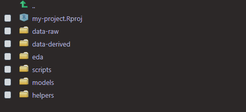
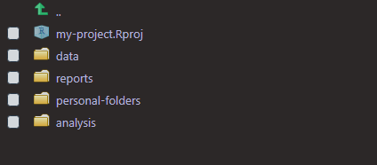

```{r setup, include=FALSE}
knitr::opts_chunk$set(echo = TRUE)
```

## Motivation

Recently, while reading through a book about creating [R Packages](https://r-pkgs.org/), I was especially impacted by a few lines concerning automation: *anything that can be automated, should be automated. Do as little as possible by hand. Do as much as possible with functions*. This philosophy has vast implications, and has caused me to reflect on different ways that I can reduce inefficiency in my work.

In addition to automating where possible, keeping your projects well organized will also make you more efficient. I am certainly not the only one who has sifted through poorly named files and folders trying find some data or script. 

The goal of this post is to save you both time and headaches. I will highlight a few practices and methods that I have found useful, and I would encourage you to seek out and share similar tips with the community! I'll assume you have some basic experience with the tidyverse.

```{r, message = FALSE}
# install.packages(c("tidyverse","fs"))
library(tidyverse) # all the things
library(fs) # for working with files
```

Let's dive right in.

----

### Autocomplete and intentional naming of variables

Take advantage of RStudio's fabulous autocomplete! Be intentional with naming objects and functions. 
While working as a tutor in a lab for R programming and data science, I would often see the most interesting and inconsistent variable names:

```{r, eval = FALSE}
# bad

WednesdayHousingData_Project
Data_That_I_Cleaned
ABBYLANEmanor2
```

Generally, variable names should strike a nice balance between being concise and descriptive. If you want, you could lean more towards descriptive names since it is easier to type more with RStudio's autocomplete.

Pick a naming convention and stick with it. I personally use snake case (all lower case letters separated by underscores). snake_case_is_arguably_easier toReadThanCamelCase. You can choose whatever you want, just be consistent.

Personally, I always name datasets `dat` (for *data*), or give them `dat` as a prefix. Some people prefer `df`, `dt` or something else. Consistency with a name or prefix makes it a lot easier to type and find objects.

```{r, eval = FALSE}
# good

dat
dat_tidy
dat_train
dat_nested

# even longer names are okay because of autocomplete

dat_linkedin_profiles
dat_canvas_long
dat_canvas_wide
```

To be fair, `dat` itself isn't super descriptive, but it is great when working with just one dataset or when used as a prefix for modified versions of a dataset. With RStudio's autocomplete, even if you forget what something is called, you can always type `dat`... and all your datasets will appear.

```{r, eval = FALSE}
# simple example of a workflow

dat_courses <- read_csv("path-to-data/data1.csv")

dat_sections <- read_csv("path-to-data/data2.csv")

dat <- dat_courses %>% 
    left_join(dat_sections)

dat %>% glimpse()

# comments about what I did to go from dat to dat2
# blah blah blah

dat2 <- dat %>%
    select(column1, column2, column3) %>% 
    filter(column3 > 50) %>% 
    mutate(
        # lots of code
    )

dat2 %>% glimpse()

# comments about what I did to go from dat2 to dat_final
# blah blah blah

dat_final <- dat2 %>% 
    group_by(column1) %>% 
    summarise(
        # all sorts of summaries
    )

dat_final %>% glimpse()
    
write_rds(dat_final, "path/data.rds")
```


<!--adsense-->


### Functions and iteration

As an R user, writing functions and iterating with the purrr package just seemed too formidable for a long time. After a lot of study and practice, however, I am far more confident in those areas. If you want to learn how to leverage these tools too, now is the time!

I will outline the basics here, and point you towards additional resources at the end of this post. I mainly want to highlight some examples that you may find helpful.

#### Functions

```{r, eval = FALSE}
# basic outline for writing a function

name <- function(variables) {
    # code here
}
```

```{r}
dat <- mtcars %>% as_tibble()
dat %>% glimpse()
```

Say there is some code that I run frequently during an analysis:

```{r, warning = FALSE, message = FALSE}
dat %>% 
  group_by(cyl) %>% 
  summarize(
    n = n(), sd = sd(mpg), median = median(mpg), mean = mean(mpg)
  )
```

I use it so much, that I want to wrap it up into a function that I'll name `get_summary`. I should look at my code and ask myself: what are the inputs? In this case, I have the data (`dat`), a variable that I want to group the summary by (`cyl`), and I also have the variable that I actually want a summary of (`mpg`). I would list those inputs as arguments inside of `function()`, and give them easy to understand names. Then I'd swap out the hard coded variable names with the argument names I just came up with. Thus, `cyl` becomes `grouping_var` and `mpg` becomes `summary_var`, both in `function()` and the main code body.

Since I am writing a function with tidyverse verbs, I also need to wrap the variables in the main body of code with `{{ }}`. More on that later. Lastly, remember that the main body of the code is nestled between curly braces `{}`. With all of that said, we end up with this: 

```{r, warning = FALSE, message = FALSE}
get_summary <- function(data, grouping_var, summary_var) {
  data %>% 
    group_by( {{ grouping_var }} ) %>% 
    summarize(
      n = n(),
      sd = sd( {{ summary_var }} ),
      median = median( {{ summary_var }} ),
      mean = mean( {{ summary_var }} )
    )
}

dat %>% get_summary(cyl, mpg)
dat %>% get_summary(am, wt)
```

Now I can use the `get_summary` function with all sorts of variables! A detailed explanation as to why we use the curly-curly `{{ }}` operator here is beyond the scope of this humble post, but I would point you towards the two best resources that I have found that explain why we need them: [Programming with dplyr](https://dplyr.tidyverse.org/dev/articles/programming.html) and [rlang 0.4.0](https://www.tidyverse.org/blog/2019/06/rlang-0-4-0/#a-simpler-interpolation-pattern-with). In short, using them allows us to write things like `cyl` and `mpg` when calling the function, instead of `dat$cyl` or `dat$mpg`. Having to use `{{ }}` may seem slightly painful at first, but it allows us to create functions that are much more user friendly, just like functions from the tidyverse.

#### Iteration

Now, onto iterating with purrr. Introducing `map`.

`map` is basically a for loop in a function. It allows you to apply a function to many things at once.

```{r, eval = FALSE}
# the map function

map(my_list, my_function)

# my_list is a list, vector, or data.frame/tibble that you want to iterate over
# my_function is a function that will be applied to each element of my_list
```

Instead of this:

```{r, eval = FALSE}
mean(dat$mpg)
mean(dat$disp)
mean(dat$hp)
# and so on...
```
 
do this: 
 
```{r}
dat %>% map(mean) # or map(dat, mean)
```

Hmm, I don't love that the output is a *list* of numbers. Let's use `map_dbl` to return a *vector* of doubles instead. `map` always returns a list, but there are other `map_*` variants that give you more control over the output. 

Run `?purrr::map` in the console for more info.

```{r}
dat %>% map_dbl(mean)
```

`map` and its friends can iterate over data.frames and tibbles because the columns are just vectors of equal length. Also, notice we just type `mean` and not `mean()`. 
Alternatively we could write:

```{r, eval = FALSE}
dat %>% map(~ mean(.x))
```

Use the `~` to signal that you are writing a function and the pronoun `.x` to represent each element of the list. For those familiar with for loops, the `.x` is similar to the `i` in `for i in ...`.

You can also use map2 to iterate over two vectors or lists at the same time. `?map2`

```{r}
a <- 1:5
b <- 5:1
a
b

map2(a, b, ~ .x * .y)
map2_dbl(a, b, ~ .x * .y)
```

In this case, `.x` represents the first list, and `.y` represent the second. 
See `?pmap` for help with 3 or more arguments.

#### Some personal examples

You can use helper functions that you have created in combination with functions from purrr to reduce duplication in your code and automate processes that are more manual.

The other day I found myself doing this a lot:

```{r}
dat %>% count(cyl)
dat %>% count(vs)
dat %>% count(am)
```

Unfortunately, using map with count is not as straightforward as `map(dat, count)`, so I wrote a function to make things easier.

```{r}
count_values <- function(data, ...) {
    select(data, ...) %>% 
        
        # the ... let you select columns like normal in dplyr::select
        
      mutate(across(everything(), as.character)) %>%  
        
        # dplyr::across is from dplyr 1.0.0 
        # dplyr::mutate_all(as.character) would do the same thing 
        
      map_dfr(~ count(tibble(value = .x), value, sort = TRUE), .id = "variable")
    
        # purrr::map_dfr outputs a row-binded tibble
}

dat %>% count_values(cyl, vs, am)
```


<!--adsense-->


#### Automate the tedious

One way to stay organized is by keeping different scripts and data in appropriately named folders. When I start fresh in a new R project, I usually create the same folders every time. I wrote a function to make this easier:

```{r, eval = FALSE}
get_started <- function() {
  dirs <- list("data-raw", "data-derived", "eda", "scripts", "models", "helpers")
  purrr::walk(dirs, fs::dir_create)
}
# walk is like map, but only calls the function for its side-effect
# dir_create creates a new directory
```

`get_started` outputs:



If you wanted more control over which folders to create, you could use `get_started2` and just input what you want.

```{r, eval = FALSE}
get_started2 <- function(...) {
  dirs <- list(...)
  purrr::walk(dirs, fs::dir_create)
}

get_started2("data", "reports", "personal-folders", "analysis")
```



#### Hold on to your helpers

Over the course of an analysis, or just your R user life in general, you will probably write a bunch of helper function to *ahem* help you. If you don't create your own R package to keep those functions, the next best thing is to keep them each in their own script with some comments documenting what they do/how to use them.

If I had all of my helper functions in a directory called *helpers*, I could source all of them with the code below:

```{r, eval = FALSE}
fs::dir_ls("helpers") %>% walk(source)

# dir_ls lists all of the files in a directory
```

### Files and folders

From the names of the directories in `get_started` and `get_started2`, can you guess what sort of files should go in each? I hope so. Names of files and folders should be easy to understand for both humans and machines. Stick with numbers, lower case letters, `_`, and `-`. That's it. Avoid funky characters and spaces. Can you image how much better the world would be if everyone did just that?

I generally like to use `_` for separating groups of things that are bigger ideas or are not necessarily related, and `-` for everything else. Here is an example of a typical project directory organized with files and folders:

* data-raw
  * 2020-03-26_canvas-assignments.csv
  * 2020-04-05_canvas-assignments.csv
  * 2020-04-18_canvas-assignments.csv
  * student-total.csv
  
* data-derived
  * canvas-tidy-current.rds
  * student-seniors.rds

* scripts
  * canvas-tidy-current.R
  * student-seniors.R
  
* helpers
  * count-values.R
  * get-started.R

* models
  * canvas-decision-tree.R
  * canvas-random-forest.R
  * student-seniors-log-regr.R
  * student-seniors-xgboost.R
  
* eda
  * 01_canvas-api.R
  * 02_canvas-courses.R
  * 03_canvas-assignments.R

### Resources for learning more

Here are some of my favorite books and tutorials that helped me to learn more about writing my own functions and iterating with purrr:

* [Functional Programming](https://dcl-prog.stanford.edu/)
* [RStudio Primers, namely the *Iterate* and *Write Functions* sections](https://rstudio.cloud/learn/primers)
* [Chapters 19 and 21 of R for Data Science](https://r4ds.had.co.nz/)

For more help with a project-oriented workflow:

* [Project-oriented workflow](https://www.tidyverse.org/blog/2017/12/workflow-vs-script/)

For more help with managing file paths:

* [here package](https://github.com/jennybc/here_here)

----

Thank you for reading!

I truly hope that something in this post as helped you! Investing time and effort into learning how to write functions, iterate with purrr, and staying well organized will pay off greatly. Stay safe and happy coding!


