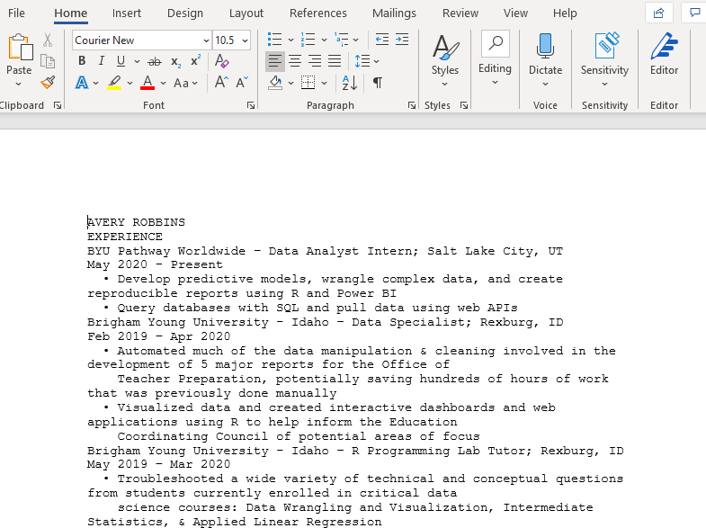

```{r setup, include=FALSE}
knitr::opts_chunk$set(echo = TRUE)
```

## Two anecdotes

If something can be automated, then it probably should be. In this post our focus will be on scraping data from PDFs.

### Poor unfortunate souls

What I am about to tell you is true.

A year or two ago I went with one of my professors and some fellow students to visit a few different companies in another state. While visiting one of the companies, we happened to stumble upon two interns that shared a cubicle together. They were working on the same project, and it was estimated that this specific project would last them their entire internship. The bulk of the project involved a seemingly tedious task: collecting data from PDFs and inputing it into excel. The PDFs appeared to have very similar, if not the same, structures and formats to them. **They were doing this manually, and it was supposed to last them two to three months**.


Frankly, we were pained to hear what they were doing. Even if learning how to programmatically scrape data from a large amount of PDFs took weeks or a month to learn, that is far better than tediously entering numbers into a spreadsheet for days on end.

Guess what. Things can be automated and made much easier with just a little programming. Google something. Ask a friend. Read some blog posts or a book. Anything. This example with the interns is just one of many examples of how having some basic programming skills can make all the difference in the world.

### Not as painful, mostly for fun

My wife recently found herself in a rather annoying situation. After graduating from college, her *Microsoft Office* subscription that she got through the school had changed. For some reason, she could only view files on her Mac, but not edit them. She couldn't even copy and paste text from a Word document. It was weird.

She was trying to update her resume, but she was locked out of the file. Our overkill solution was to take a screen shot of the Word document, convert it to a PDF, email me the PDF, and have me use R to scrape the data from it. There surely exist simpler solutions, but I, perhaps selfishly, wanted to help by using R. I just had to remember how to scrape data from PDFs. Turns out it is super simple.

## PDF scraping

Install the `pdftools` package for reading data from a PDF, and optionally the `readr` package for reading and writing data to and from R.

```{r}
# install.packages(c("pdftools", "readr"))

library(pdftools)
library(readr)
```

For this example, I am using an edited version of my own resume that I have on GitHub. Using the url and some base R functions, I download the resume from GitHub and store it in a temporary file. After that I just use the `pdf_text` function from `pdftools` to grab all of the text data from my resume. It reads all of the data into a single character vector, so often times, and depending on the task at hand, you would need to do a bit of data wrangling to get your data in the desired format. The pdf-scraping, however, is incredibly simple.

```{r}
url <- "https://github.com/averyrobbins1/robbins-data/blob/master/documents/avery-robbins-resume.pdf?raw=true"

temp <- tempfile()

download.file(url, temp, mode = "wb")

dat <- pdftools::pdf_text(temp)
```

**If the PDF comes from a scan, you will probably have to use pdf_ocr_text instead**. See `?pdftools::pdf_ocr_text`

For our purposes, I just wrote the data back out to a csv, and my wife just copied and pasted the text and put it in a google doc. Alternatively, you could also write the data to a Word doc if you need to.

```{r, eval = FALSE}
readr::write_file(dat, "resume-robbins-avery.doc")
```




Lastly.

If those poor interns had all of the PDFs in a single directory, they probably could have written similar code to the following:

```{r, eval = FALSE}
dat <- fs::dir_ls("some_directory") %>% 
    purrr::walk(~ pdftools::pdf_text(.x))
```

List all of the PDF files in some directory containing just those files. Then `walk` through the directory and run `pdf_text` on each PDF. `walk` is similar to `purrr::map`. `?walk`

After having scraped all of the data, the interns could have then probably worked on wrangling the data for a week or two.

## Conclusion

That's pretty much it. Check out the [pdftools GitHub](https://github.com/ropensci/pdftools) to learn more about the package. [tabulizer](https://github.com/ropensci/tabulizer) is another good package for extracting tables from PDFs.

Thank you for reading! Take care.
