```{r setup, include=FALSE}
knitr::opts_chunk$set(warning=FALSE, message=FALSE, echo = FALSE, eval = FALSE)
```

## Welcome!

If this is your first time reading my blog, then welcome! If this is not your first time, then welcome back! The website is still pretty new, but it is awesome to see so many people take an interest in what I have been sharing! If you find this informal analysis of *The Office* entertaining, then please share it with a friend!

As a side note, all of the graphs you will see were created using the R programming language, and the data used is from the `schrute` R package.

## Motivation

**To be honest, when I saw the image below for the first time a little voice in my head whispered, "satchel!"** Is that sad? Haha! True fans of *The Office* will understand. A couple weeks ago I analyzed transcript data for [Avatar: The Last Airbender](https://www.avery-robbins.com/2020/07/11/avatar-eda/), and this time around I thought it would be fun to take a closer at another of my favorite TV shows. So, put on your *Gettysburg hats* and let's dive right in.

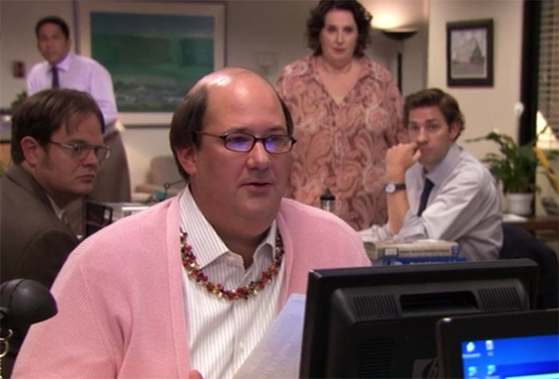


```{r}
# packages

# devtools::install_github("xvrdm/ggrough")

library(tidyverse)
library(lubridate)
library(tidytext)
library(gghighlight)
library(extrafont)
library(xkcd)
library(sometools)
library(ggrough)
library(ggforce)
library(ggthemr)
library(ggtext)
library(ggrepel)
library(patchwork)
library(glue)

ggthemr("fresh")

dat <- schrute::theoffice %>% 
    mutate(air_date = ymd(air_date))
```


```{r}
dat %>%
  mutate(text = str_to_lower(text)) %>%
  filter(
    str_detect(
      text, "(that\'s what she said)|(that\'s what she said\\.)"
      )
    ) %>% 
  select(season, character, episode, episode_name, text)

dat_she <- dat %>% 
  unnest_tokens(sentence, text, token = "sentences") %>% 
  mutate(sentence = str_to_lower(sentence),
         character = str_trim(character),
         she_said = str_detect(sentence, "that\'s what she said"))

dat_she <- dat_she %>%
  filter(she_said == TRUE) %>% 
  count(she_said, character, sort = TRUE) %>% 
  mutate(id = row_number()) %>% 
  select(-she_said)

p <- dat_she %>% 
  ggplot(aes(x = fct_reorder(character, desc(n)), y = n)) +
  geom_col() +
  gghighlight(character == "Michael") +
  labs(x = NULL, y = NULL, title = '"That\'s  what she said"') +
  theme_minimal() +
  theme(panel.grid.major.y = element_blank(),
  text = element_text(family = "Comic Sans MS", size = 18),
  panel.grid.major = element_blank(),
  panel.grid.minor = element_blank())

options <- list(
  Background = list(roughness = 8),
  GeomCol = list(fill_style = "zigzag", angle_noise = 0.5, fill_weight = 2)
)

get_rough_chart(p, options)
```

----

*How many times do you think Michael Scott uttered his famous line - "That's what she said?"*

According to the transcript data - 23 times! Some others joined in as well, but it was truly Michael's joke. Am I missing anyone? I did notice that the group "That's what she said!" from *Beach Games* was missing from the data.

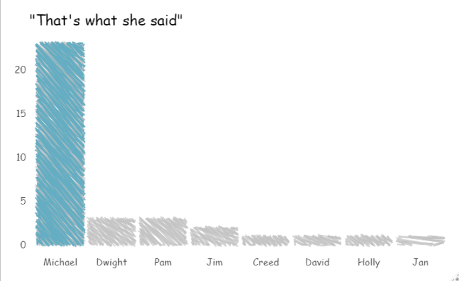


```{r}
dat_episodes <- dat %>% 
    distinct(season, episode, episode_name, director,
             writer, imdb_rating, total_votes, air_date) %>% 
  group_by(season) %>% 
  mutate(episode_high = if_else(imdb_rating == max(imdb_rating), 1, 0)) %>% 
  ungroup()

avg_ratings <- dat_episodes %>% 
  group_by(season) %>% 
  summarise(avg = median(imdb_rating),
            x_position = median(episode))

dat_michael <- dat_episodes %>%
  filter(episode_name == "Goodbye, Michael") %>% 
  mutate(episode_name = str_replace(
    episode_name, "Goodbye, Michael", "Goodbye,\nMichael"
  ))

dat_toby <- dat_episodes %>%
  filter(episode_name == "Goodbye, Toby (Parts 1&2)") %>% 
  mutate(episode_name = "Goodbye,\nToby")

dat_season_avg <- tribble(
  ~x, ~xend, ~y, ~yend, ~season,
  6,   10,    7.95,  7.87,    1
)

ggplot() +
    geom_point(dat_episodes, mapping = aes(episode, imdb_rating), alpha = .75) +
    geom_point(avg_ratings,
               mapping = aes(x = x_position, y = avg),
               size = 2.5, shape = 17, color = "firebrick") +
    geom_point(dat_michael,
                    mapping = aes(x = episode,
                                  y = imdb_rating), size = 3) +
    geom_text(dat_michael,
                    mapping = aes(x = episode,
                                  y = imdb_rating,
                                  label = episode_name),
                    size = 3.5, nudge_x = -10, family="xkcd") +
    geom_text(avg_ratings %>% filter(season == 1),
              mapping = aes(x = x_position + 15, y = 7.85, label = "Season\nAverages"),
              size = 3.5, family="xkcd") +
    geom_segment(data = dat_season_avg,
                 mapping = aes(x = x, xend = xend, y = y, yend = yend)) +
    facet_wrap(~ season, nrow = 1) +
    labs(
      title = "It was really never the same after Michael left",
      x = "Episodes", y = "IMDB Ratings",
      caption = "Seasons 1-9") +
  theme(text=element_text(size=16, family="xkcd"),
        axis.line = element_blank())
```

----

Who doesn't love the *world's best boss*, Michael Scott? After season one, of course. The IMDB ratings definitely support that Michael was well loved by many. In the entire series, seasons three and four had the highest average (median) ratings, while the ratings suffered quite a bit after Michael left.

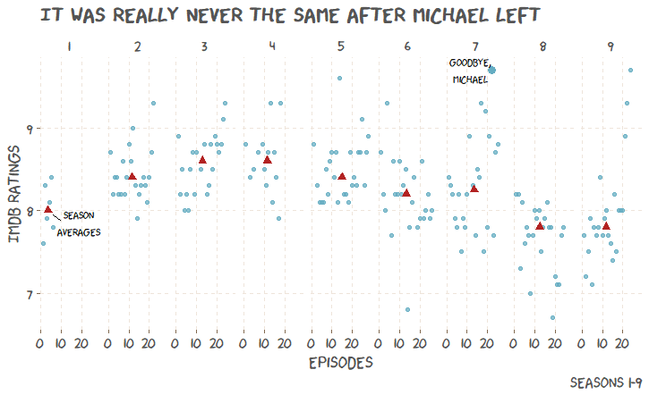

```{r}
ggplot() +
    geom_point(dat_episodes, mapping = aes(episode, imdb_rating), alpha = .75) +
    geom_point(dat_michael,
                    mapping = aes(x = episode,
                                  y = imdb_rating), size = 3) +
    geom_text(dat_michael,
                    mapping = aes(x = episode,
                                  y = imdb_rating,
                                  label = episode_name),
                    size = 3.5, nudge_x = -10, family="xkcd") +
    geom_point(dat_toby,
                    mapping = aes(x = episode,
                                  y = imdb_rating), size = 3) +
    geom_text(dat_toby,
                    mapping = aes(x = episode,
                                  y = imdb_rating,
                                  label = episode_name),
                    size = 3.5, nudge_y = .3, family="xkcd") +
    facet_wrap(~ season, nrow = 1) +
    labs(
      title = "And we loved Michael more than Toby",
      x = "Episodes", y = "IMDB Ratings",
      caption = "Seasons 1-9") +
  theme(text=element_text(size=16, family="xkcd"),
        axis.line = element_blank())
```

----

Admittedly, this next graph is pretty random, but I wanted to highlight both Michael's and Toby's "goodbye" episodes. Toby's was rated fairly high, but Michael was such an icon that his was one of the highest rated episodes of the series.

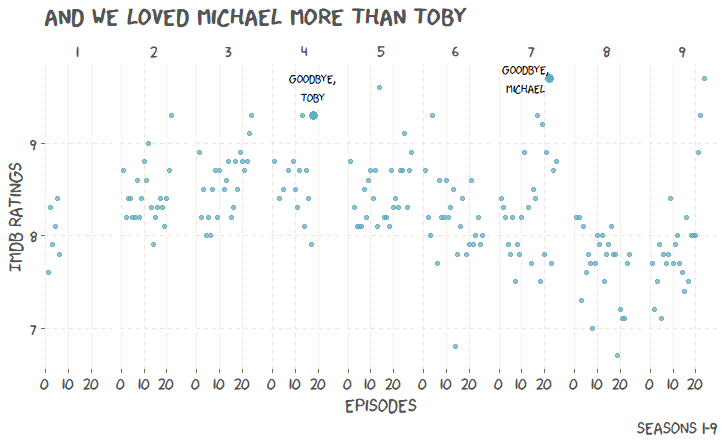


```{r}
# color by who is the boss

dat_manager <- dat %>%
  distinct(season, episode, episode_name, imdb_rating) %>%
  arrange(season, episode) %>%
  mutate(
    manager = case_when(
      row_number() %in% c(1:50,52:83,90:93,107:133) ~ "Michael",
      row_number() %in% 84:89                       ~ "Charles",
      row_number() %in% 94:106                      ~ "Jim, Michael",
      row_number() %in% 134:137                     ~ "Deangelo",
      row_number() %in% c(51,138,184:186)           ~ "Dwight",
      row_number() %in% 139                         ~ "Creed",
      row_number() %in% c(140:157,164:183)          ~ "Andy",
      row_number() %in% 158:163                     ~ "Nellie",
      TRUE ~ "Other"
    )
  )

michael <- dat_manager %>%
  filter(season == 1, manager == "Michael")

dwight_first <- dat_manager %>%
  filter(season == 3, manager == "Dwight")

dwight_second <- dat_manager %>%
  filter(season == 7, manager == "Dwight")

creed <- dat_manager %>%
  filter(season == 7, manager == "Creed")

andy <- dat_manager %>%
  filter(season == 8, manager == "Andy", episode == 5)

# set.seed(123)
# 
# ggplot() +
#     geom_point(dat_manager,
#        mapping = aes(episode, imdb_rating, color = manager)) +
#     # geom_point(dat_manager %>% filter(manager == "Michael"),
#     #      mapping = aes(episode, imdb_rating, color = manager),
#     #      size = 2.5) +
#     geom_text(michael %>% filter(episode == 1),
#            mapping = aes(episode, imdb_rating,
#                          label = "Michael's documentary debut"),
#            nudge_x = 10, nudge_y = 1.25, family="xkcd") +
#     geom_point(dat_manager %>% filter(manager == "Dwight"),
#            mapping = aes(episode, imdb_rating, color = manager),
#            size = 2.5) +
#     geom_text(dwight_first,
#                       mapping = aes(x = episode,
#                                     y = imdb_rating +.1,
#                                     label = "Dwight's first taste"),
#                       nudge_x = -10, family="xkcd") +
#     geom_segment(data = dwight_first,
#                    mapping = aes(x = 21.5, xend = 23.25,
#                                  y = 9.4, yend = 9.3)) +
#     geom_text(dwight_second,
#                       mapping = aes(x = episode,
#                                     y = imdb_rating +.2,
#                                     label = "Gun Safety Dwight!"),
#                       nudge_x = -15, nudge_y = -2, family="xkcd") +
#     geom_segment(data = dwight_second,
#                      mapping = aes(x = 16, xend = 22.95,
#                                    y = 7, yend = 8.6)) +
#     geom_point(dat_manager %>% filter(manager == "Creed"),
#              mapping = aes(episode, imdb_rating, color = manager),
#              size = 2.5) +
#     geom_text(creed,
#                     mapping = aes(x = episode,
#                                   y = imdb_rating,
#                                   label = "Great Bratton"),
#                     nudge_x = -12, nudge_y = 1, family="xkcd") +
#     geom_segment(data = creed,
#                        mapping = aes(x = 18.15, xend = 24.5,
#                                      y = 9.6, yend = 8.9)) +
#     geom_mark_ellipse(dat_manager,
#                       mapping = aes(episode, imdb_rating,
#                                     filter = manager %in% 
#                             c("Nellie","Charles","Deangelo"),
#                           description = manager),
#                           label.family = "xkcd") +
#     geom_text(dat_manager %>%
#                 filter(manager == "Jim, Michael",
#                        episode == 10),
#                       mapping = aes(episode, imdb_rating,
#                                     label = "Co-managers"),
#                           nudge_y = 0.5, family = "xkcd") +
#     geom_mark_ellipse(dat_manager,
#                         mapping = aes(episode, imdb_rating,
#                                       filter = manager == "Dwight" &
#                                         season == 9,
#                             description = "Dwight"),
#                             label.family = "xkcd") +
#     geom_text(andy,
#              mapping = aes(episode, imdb_rating,
#                            label = "Andy"),
#              nudge_x = 0, nudge_y = 1, family="xkcd") +
#     facet_wrap(~ season, nrow = 3) +
#     labs(
#       title = "The many managers of the Scranton Branch",
#       x = "Episodes", y = "IMDB Ratings",
#       caption = "Seasons 1-9") +
#     theme(text=element_text(size=16, family="xkcd"),
#         axis.line = element_blank())
```

----

Throughout the entire series, there are at least eight different managers of the Scranton branch (not counting Robert California's few seconds before he became CEO). Of the managers who were not Michael Scott, Creed was definitely my favorite:

"It's a beautiful morning at Dunder-Mifflin, or as I like to call it, Great Bratton. Keep it running." *throws keys* 
- Creed

```{r}
p2 <- dat_manager %>% 
  count(manager, sort = TRUE) %>% 
  ggplot(aes(y = fct_reorder(manager, desc(n)), x = n)) +
  geom_col() +
  gghighlight(manager == "Michael") +
  labs(x = NULL, y = NULL,
       title = 'Episodes as manager of Scranton branch') +
  scale_x_continuous(limits = c(0,120),
                     breaks = seq(0,120,20)) +
  theme_minimal() +
  theme(
  panel.grid.major.y = element_blank(),
  text = element_text(family = "Comic Sans MS", size = 18),
  panel.grid.major = element_blank(),
  panel.grid.minor = element_blank())

options2 <- list(
  Background = list(roughness = 8),
  GeomCol = list(fill_style = "zigzag", angle_noise = 0.5, fill_weight = 2)
)

get_rough_chart(p2, options2)
```

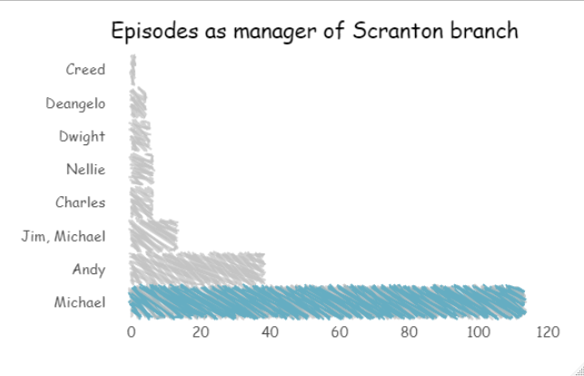

```{r}
plot1 <- ggplot() +
    geom_point(dat_manager %>% filter(season %in% 1:3),
       mapping = aes(episode, imdb_rating, color = manager)) +
    geom_text(michael %>% filter(episode == 1),
           mapping = aes(episode, imdb_rating,
                         label = "Michael's documentary debut"),
           nudge_x = 10, nudge_y = 1.25, family="xkcd") +
    geom_point(dat_manager %>%
                 filter(manager == "Dwight") %>%
                 filter(season %in% 1:3),
           mapping = aes(episode, imdb_rating, color = manager)) +
    geom_text(dwight_first,
                      mapping = aes(x = episode,
                                    y = imdb_rating +.1,
                                    label = "Dwight's first taste"),
                      nudge_x = -10, family="xkcd") +
    geom_segment(data = dwight_first,
                   mapping = aes(x = 21.5, xend = 23.25,
                                 y = 9.4, yend = 9.3)) +
  facet_wrap(~ season) +
    labs(
      title = "The many managers of Dunder Mifflin, Scranton",
      x = NULL, y = NULL,
      caption = NULL) +
    theme(text=element_text(size=16, family="xkcd"),
        axis.line = element_blank()) +
  scale_color_manual(values = c("#000003", "#4a8fd9"))

plot1

# dwight "#000003"
# michael "#4a8fd9"

set.seed(123)

plot2 <- ggplot() +
    geom_point(dat_manager %>% filter(season %in% 4:6),
       mapping = aes(episode, imdb_rating, color = manager)) +
    geom_mark_ellipse(dat_manager %>% filter(season %in% 4:6),
                        mapping = aes(episode, imdb_rating,
                                      filter = manager == "Charles",
                            description = "Charles"),
                            label.family = "xkcd") +
      geom_text(dat_manager %>%
                  filter(season %in% 4:6) %>% 
                  filter(manager == "Jim, Michael",
                         episode == 10),
                        mapping = aes(episode, imdb_rating,
                                      label = "Co-managers"),
                            nudge_y = 0.5, family = "xkcd") +
  facet_wrap(~ season) +
    labs(
      title = NULL,
      x = NULL, y = "IMDB Ratings",
      caption = NULL) +
    theme(text=element_text(size=16, family="xkcd"),
        axis.line = element_blank()) +
  scale_color_manual(values = c("#cf1c00", "#5a35b0", "#4a8fd9"))

plot2

# charles #cf1c00
# jim, michael #5a35b0

set.seed(123)

plot3 <- ggplot() +
    geom_point(dat_manager %>% filter(season %in% 7:9),
       mapping = aes(episode, imdb_rating, color = manager)) +
    geom_text(dwight_second,
                      mapping = aes(x = episode,
                                    y = imdb_rating +.2,
                                    label = "Gun Safety Dwight!"),
                      nudge_x = -15, nudge_y = -2, family="xkcd") +
    geom_segment(data = dwight_second,
                     mapping = aes(x = 16, xend = 22.95,
                                   y = 7, yend = 8.6)) +
    geom_point(dat_manager %>% filter(manager == "Creed"),
             mapping = aes(episode, imdb_rating, color = manager)) +
    geom_text(creed,
                    mapping = aes(x = episode,
                                  y = imdb_rating,
                                  label = "Great Bratton"),
                    nudge_x = -12, nudge_y = 1, family="xkcd") +
    geom_segment(data = creed,
                       mapping = aes(x = 18.15, xend = 24.5,
                                     y = 9.6, yend = 8.9)) +
    geom_mark_ellipse(dat_manager %>% filter(season %in% 7:9),
                      mapping = aes(episode, imdb_rating,
                                    filter = manager %in% 
                            c("Nellie","Deangelo"),
                          description = manager),
                          label.family = "xkcd") +
    geom_mark_ellipse(dat_manager %>% filter(season %in% 7:9),
                        mapping = aes(episode, imdb_rating,
                                      filter = manager == "Dwight" &
                                        season == 9,
                            description = "Dwight"),
                            label.family = "xkcd") +
    geom_text(andy,
             mapping = aes(episode, imdb_rating,
                           label = "Andy"),
             nudge_x = 0, nudge_y = 1, family="xkcd") +
    facet_wrap(~ season) +
    labs(
      title = NULL,
      x = "Episodes", y = NULL,
      caption = "Seasons 1-9") +
    theme(text=element_text(size=16, family="xkcd"),
        axis.line = element_blank()) +
  scale_color_manual(values = c("#d6be06", "#117301", "#cf1c00",
                                "#000003", "#4a8fd9", "#9e0578"))

plot3

# andy #d6be06
# creed #14c401
# deangelo "#cf1c00"
# dwight "#000003"
# michael "#4a8fd9"
# nellie "#9e0578
```

----

Now let's look at the entire series and identify when each manager was manager.

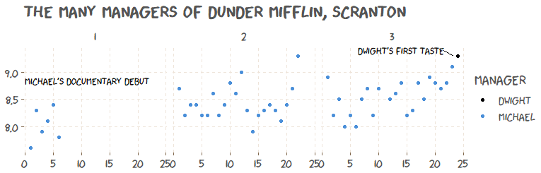


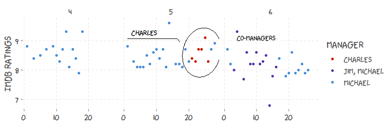


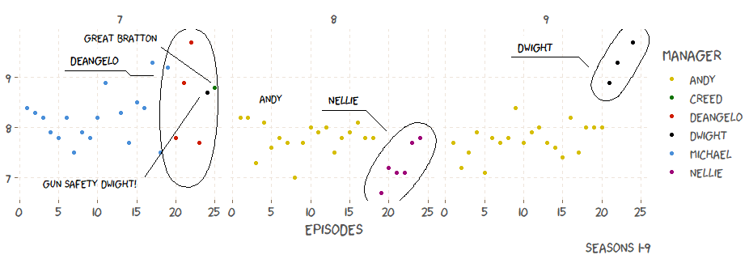

----

A good way of figuring out who was the most liked branch manager of Dunder Mifflin, Scranton, would be to take a poll asking the question: "Who was your favorite Scranton branch manager in The Office?" I would guess the favorite would turn out to be Michael.
Another way to gain some insight into the likability of specific managers would be to look at the episode ratings for each episode that they were manager. This is likely flawed because 1) some characters were managers during season finales (or a series finale in Dwight's case), and those episodes tend to rate higher than others, and 2) there is a large difference between number of episodes as manager for each character.

Either way, this method will just have to do. Using episode ratings certainly supports something that I agree with: Nellie was the worst branch manager! I am sorry, but I just wasn't a fan of her. Also, I would say that Deangelo is rated too high on this scale, and it is probably because I classified him as manager during the episode, *Goodbye, Michael*.

```{r}
set.seed(123)

dat_manager %>% 
  ggplot(aes(x = fct_reorder(manager, imdb_rating), y = imdb_rating)) +
  geom_boxplot(alpha = 0.4, outlier.shape = NA) +
  geom_jitter(color = "firebrick", alpha = 0.75) +
  labs(y = "IMDB Ratings", x = NULL,
       title = "Evaluating branch managers by their episode ratings") +
   theme(text=element_text(size=16, family="xkcd"),
        axis.line = element_blank())
```

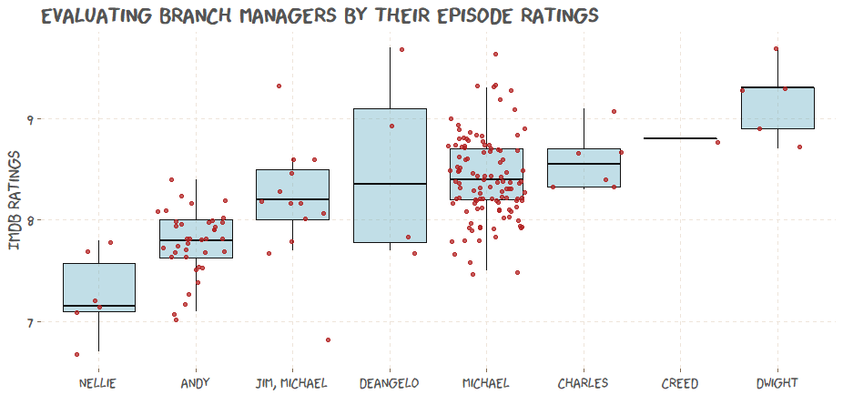

```{r}
dat_season_words <- dat %>% 
  unnest_tokens(word, text) %>% 
  count(word, season, sort = TRUE)

dat_total_words <- dat_season_words %>% 
  group_by(season) %>% 
  summarize(total = sum(n))

dat_words <- left_join(dat_season_words, dat_total_words)

dat_words <- dat_words %>% 
  bind_tf_idf(word, season, n)

options(scipen = 999)

plot_tf_idf <- function(season_num) {
  plot <- dat_words %>% 
  select(-total) %>% 
  arrange(desc(tf_idf)) %>% 
  mutate(word = factor(word, levels = rev(unique(word)))) %>% 
  group_by(season) %>% 
  top_n(10) %>% 
  ungroup() %>% 
  filter(season == season_num) %>% 
  ggplot(aes(x = tf_idf, y = word)) +
  geom_col(show.legend = FALSE) +
  gghighlight(max(tf_idf), max_highlight = 1L) +
  labs(x = "tf-idf", y = NULL,
       title = glue("Season {season_num}")) +
  theme(
    panel.grid.major = element_blank(),
    panel.grid.minor = element_blank(),
    text = element_text(family = "Comic Sans MS", size = 18)
  )
  
  options <- list(
  Background = list(roughness = 8),
  GeomCol = list(fill_style = "zigzag",
                 angle_noise = 0.5,
                 fill_weight = 2))
  
  get_rough_chart(plot, options)
  
}

plots <- map(1:9, ~ plot_tf_idf(.x))
```

----

Okay, now let's take a look at *important* words in each season. One measure of how important a word may be is a simple word count, or *term frequency* (how frequently a word occurrs in a body of text). Another measure is something called *inverse document frequency*. This statistic makes very commonly used words less important and increases the importance of words that are not used very much in a collection of texts. In this case, the entire *collection of text* is the series, while each document or body of text is each individual season.

We can take both of these, the term frequency (tf) and the inverse document frequency (idf), and multiply them together to create the *tf-idf* statistic. Basically, the tf-idf statistic will identify words that are important in each individual season within the entire series. I hope that makes sense.

Even though I am not an expert on tf-idf, I needed to explain it because that is the x-axis of the next several graphics.

Here we go:

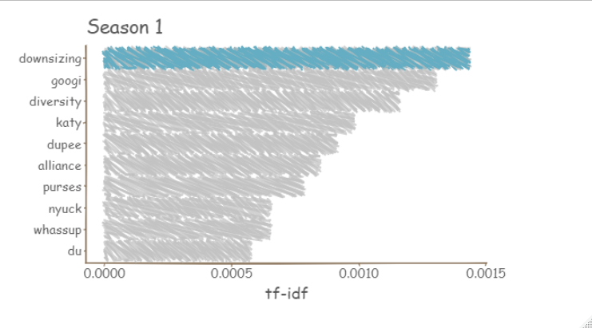

Downsizing is the talk of the town in season 1. Be sure to form an alliance with your co-workers if you don't want to be next.


Also, there are a couple of odd words here. And there are a few odd words in pretty much every season. Where do they come from?

Here are a couple lines taken directly from the transcript data:

*Oh! Welcome to my convenience store. Would you like some googi googi? I have some very delicious googi, googi, only 99 cents plus tax. Try my googi, googi. Try my googi, googi. Try my googi, googi. Try my...* - Michael

*Watch this. This is Moe. Nyuck-nyuck-nyuck-nyuck-nyuck. Mee! Ah, right here. Three Stooges. Oh, Pam. It's a guy thing, Pam. I'm sort of a student of comedy. Watch this. Here we go. I'm Hitler. Adolf Hitler.* - Michael

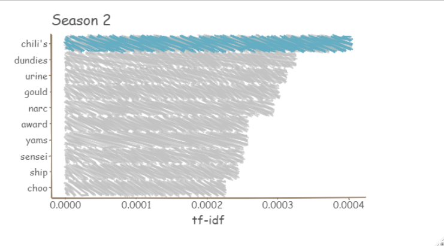

Some favorites:

*And, I feel God in this Chili's tonight. WHOOOOOOOO!!!!* - Pam

*Well, surely this uh, review is a formality because of what happened uh, at our meeting in the parking lot of Chili's.* - Michael

*Don't think of it that way. It's like, urine goes all over the place. You know, there's no controlling it. It just... goes* - Michael

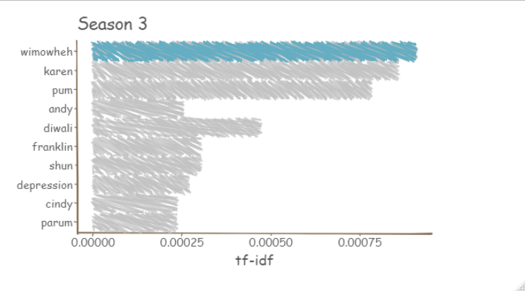

Makes sense:

*There are five stages to grief, which are denial, anger, bargaining, depression, and acceptance. And right now, out there, they're all denying the fact that they're sad. And that's hard. And it's making them all angry. And it is my job to try to get them all the way through to acceptance. And if not acceptance, then just depression. If I can get them depressed, then I'll have done my job.* - Michael

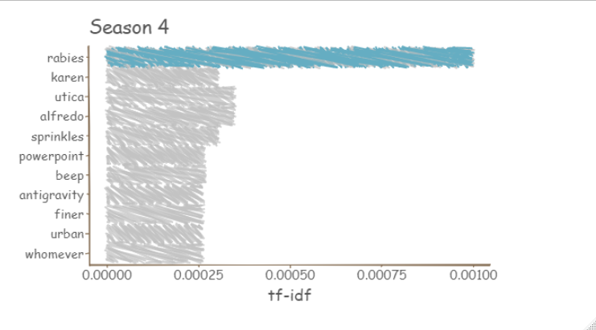

Rabies is serious.

*Michael Scott's Dunder-Mifflin, Scranton, Meredith Palmer memorial, celebrity rabies awareness, fun run race for the cure, this is Pam.* - Pam

*And also there is no such thing as a rabies doctor.* - Pam

Inspirational:

*Finishing that 5k, was the hardest thing I have ever had to do. I ate more fettuccine alfredo and drank less water, than I have in my entire life. People always talk about triumphs of the human spirit, well today I had a triumph of the human body. That's why everybody was applauding for me at the end. My guts and my heart, and while I eventually puked my guts out, I never puked my heart out. And I'm very, very proud of that.*
- Michael

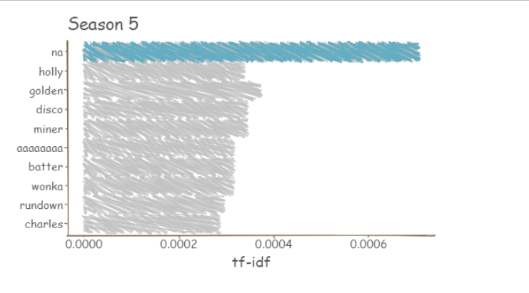

*So I love Willy Wonka. That golden ticket scene is so inspiring to me that that's where I cam up with that idea.* - Dwight

Now it's kind of interesting that, from Season 6 and on, a lot of the words that are deemed important are new characters that are introduced. This makes me think that they kept adding new characters to try and keep things interesting. Not say that that is what the data is saying per se, but it's a thought.

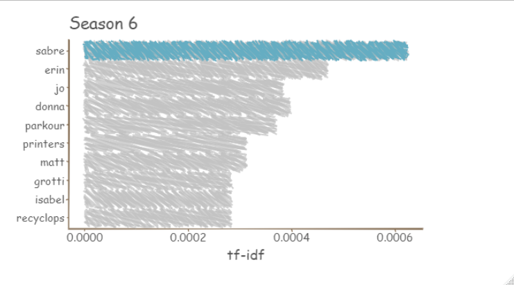

*Recyclops destroys!* - Dwight

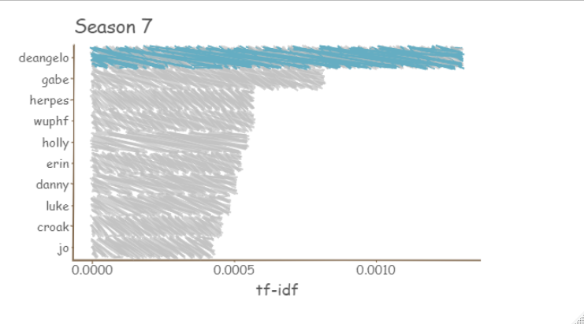

*Croak, croak, croak. Bullfrog in love.* - Darryl, Kevin, Andy

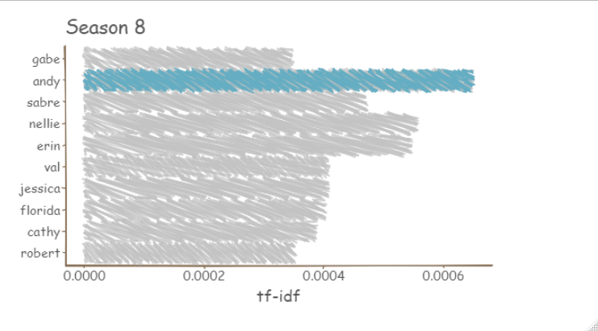

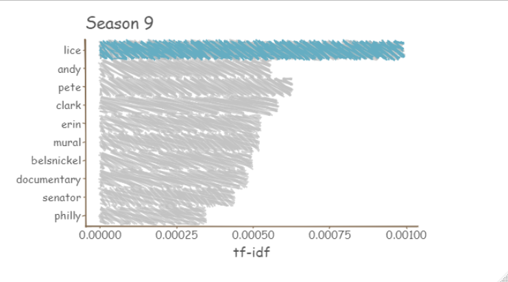

*It's a Hazmat suit. That stands for hazaderous materials men's suit wearing. If you rent more than four times a year, it just makes sense to buy. Is there anyone else here that is lice free? Excellent. Do you have your own hazmat suits?*

## Conclusion

That's all for now! There is so much more that we could do here. In the future, I want to try and do some more advanced things, like a machine learning  model or two. If you have specific questions that you think can be answered from the data, put them in the comments below. Thanks so much for reading!

```{r}
# Zipf’s law states that the frequency that a word appears is inversely proportional to its rank.
# 
# One measure of how important a word may be is its term frequency (tf), how frequently a word occurs in a document
# 
# Another approach is to look at a term’s inverse document frequency (idf), which decreases the weight for commonly used words and increases the weight for words that are not used very much in a collection of documents. This can be combined with term frequency to calculate a term’s tf-idf (the two quantities multiplied together), the frequency of a term adjusted for how rarely it is used.
# 
# The statistic tf-idf is intended to measure how important a word is to a document in a collection (or corpus) of documents, for example, to one novel in a collection of novels or to one website in a collection of websites
# 
# "These words are, as measured by tf-idf, the most important to each novel and most readers would likely agree. What measuring tf-idf has done here is show us that Jane Austen used similar language across her six novels, and what distinguishes one novel from the rest within the collection of her works are the proper nouns, the names of people and places. This is the point of tf-idf; it identifies words that are important to one document within a collection of documents."

dat_freq <- dat_words %>% 
  group_by(season) %>% 
  mutate(
    rank = row_number(),
    term_freq = n/total
  )

zipf_plot <- dat_freq %>% 
  mutate(season = as_factor(season)) %>% 
  ggplot(aes(rank, term_freq, group = season)) +
  geom_line(alpha = 0.75) +
  scale_x_log10() +
  scale_y_log10()

mid <- dat_freq %>% 
  filter(rank < 1000,
         rank > 10)

lm(log10(`term_freq`) ~ log10(rank), data = mid)

zipf_plot +
  geom_abline(intercept = -0.3788, slope = -1.2128,
              color = "gray50", linetype = 2)

dat %>% 
  filter(str_detect(text, "googi")) %>% 
  select(text)

dat %>% 
  filter(str_detect(text, "dupee")) %>% 
  select(character, text)


# The rise and fall of ryan howard
# money time period scranton vp temp salesman 
```

```{r, include = FALSE}

# xkcd scatter plot

# data <- dat_she
# 
# data$xmin <- data$id - 0.15
# data$xmax <- data$id + 0.15
# data$ymin <- 0
# data$ymax <- data$n
# 
# xrange <- range(min(data$xmin), max(data$xmax))
# yrange <- range(min(data$ymin), max(data$ymax) + 3)
# mapping <- aes(xmin=xmin,ymin=ymin,xmax=xmax,ymax=ymax)
# 
# set.seed(123)
# 
# ggplot() + xkcdrect(mapping, data) + xkcdaxis(xrange,yrange) +
#   annotate("text",
#            x = data$id,
#            y = data$n + 1,
#            label = data$character,
#            family = "xkcd")
#   theme(panel.grid.major.y = element_blank(),
#         text=element_text(family="Comic Sans MS", size=16))
#   

# download.file("http://simonsoftware.se/other/xkcd.ttf", dest="xkcd.ttf", mode="wb")
# 
# font_import(getwd(), pattern = "[X/x]kcd", prompt=FALSE)
# 
# fonts()
# 
# if(.Platform$OS.type != "unix") {
#   loadfonts(device="win")} else {loadfonts()}
```
