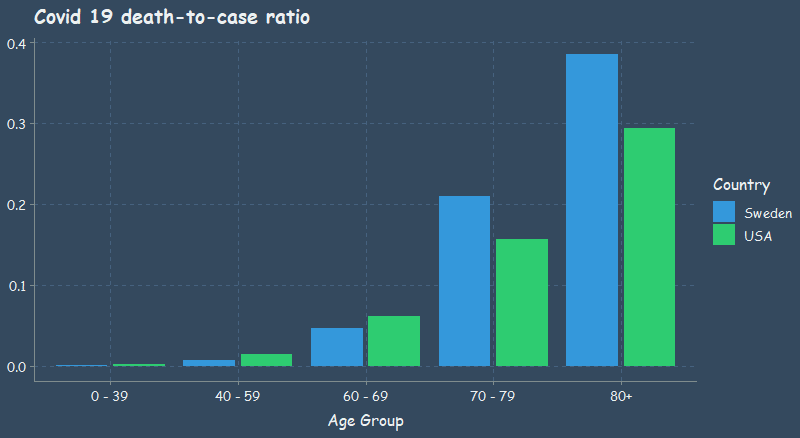

```{r setup, include=FALSE}
knitr::opts_chunk$set(echo = TRUE, warning=FALSE, message=FALSE)
```



## So Covid is actually dangerous to Grandma

**According to CDC data (current as of 2020/07/16), almost 1 out of 3 people over 80 years old who contracted Covid 19 in the US died.**

Hold on. There are some major problems with the above statement. The truth is the data that's available just isn't high quality. I researched multiple data sources in preparation for this post, and the actual numbers vary. We can't know the actual number of positive cases in the US. We have a huge population of over 330 million people. False positives and false negatives exist, and there are certainly inviduals who have had Covid who haven't been tested. 

Furthermore, there are Covid reported deaths that are reported inaccurately, or that involve other factors, such as pre-exisiting conditions or illnesses. My wife just taught me a new word, *comorbidity*: the simultaneous presence of two or more chronic diseases or conditions in a patient. Sadly, someone can be dying of cancer, contract Covid in the eleventh hour, and then they will pass away and be counted as a Covid death. Seems sketchy.

**With all that being said, even if we don't know the exact numbers, we can see trends that suggest that Covid is indeed more dangerous to the elderly. The opposite also seems to be true: Covid 19 really isn't that harmful to young people.**

Looking at the table below, if we believe that this data is even somewhat accurate, we can see that there is extremely low risk for individuals under 40 years old. There is also very low risk even for persons in their 40s and 50s. Lastly, it is clear that individuals 70 years of age and older are at great risk.

```{r, echo = FALSE}

library(tidyverse)
library(janitor)
library(ggthemr)
library(patchwork)

ggthemr("flat dark", type = "outer")

dat_us <- read_csv("https://github.com/averyrobbins1/robbins-data/blob/master/covid-data/cdc-covid-data.csv?raw=true")

dat_us <- dat_us %>% mutate(age_group = str_remove(age_group, " Years"))

dat_us <- dat_us %>% filter(age_group != "Unknown", !is.na(age_group))

dat_us2 <- dat_us %>%
  mutate(
    age_group = case_when(
      age_group %in% c("0 - 9", "10 - 19", "20 - 29", "30 - 39") ~ "0 - 39",
      age_group %in% c("40 - 49", "50 - 59")                     ~ "40 - 59",
      TRUE                                                       ~ age_group
    )
  ) %>% 
  group_by(age_group, death) %>% 
  summarize(n = sum(n)) %>% 
  mutate(cases = sum(n)) %>% 
  filter(death != "no death") %>% 
  transmute(age_group, deaths = n,  cases,
            death_to_case_ratio = (deaths/cases),
            country = "USA") %>% 
  ungroup()

dat_us2 %>% knitr::kable(caption = "Data current as of 2020/07/16")
```

Here is the same data, but for Sweden.

```{r, echo = FALSE}
dat_swed <- read_csv("https://github.com/averyrobbins1/robbins-data/blob/master/covid-data/swedish-covid-data.csv?raw=true") %>% clean_names()

dat_swed2 <- dat_swed %>% 
  mutate(age_group = str_replace(age_group, "_", " - "),
           age_group = ifelse(age_group == "80 - 89" | age_group == "90 - plus",
                              "80+", age_group)) %>% 
  filter(!is.na(age_group)) %>% 
  select(age_group, cases = total_number_of_cases, deaths = total_number_of_deaths) %>%
  mutate(
    age_group = case_when(
      age_group %in% c("0 - 9", "10 - 19", "20 - 29", "30 - 39") ~ "0 - 39",
      age_group %in% c("40 - 49", "50 - 59")                     ~ "40 - 59",
      TRUE                                                       ~ age_group
    )
  ) %>% 
  group_by(age_group) %>%
  summarize(cases = sum(cases), deaths = sum(deaths)) %>% 
  mutate(death_to_case_ratio = (deaths/cases),
         country = "Sweden")

dat_swed2 %>% knitr::kable(caption = "Data current as of 2020/08/05")
```

## Why Sweden?

Why am I comparing the US and Sweden? My father sent me an [article](https://www.zerohedge.com/political/destroying-western-medias-swedish-public-health-disaster-narrative-two-simple-charts) commenting on the Western media's narrative with regards to the "Swedish Public Health Disaster." Actually, the article was flat out refuting that there was even a public health disaster. This is a very politically charged topic, so I won't go into it too much. However, the basic argument is about lockdowns for Covid. *To lock down or not to lock down, that is the question.*

Like I said, I don't want to get too political, but I also want to try and make sense of the available data. Most of the workforce in the US is relatively young, right? A quick search on the *interwebs* reports the average age of US workers to be 42.3 years. That means that the vast majority of the working class has little to no risk from Covid, right? What if we allowed people to go to work who wanted to work, and focus most of our efforts on protecting the elderly? I am curious to hear other people's opinions. Is this view too simplistic?

At least from the death-to-case ratio that I plotted, we can see that Sweden did worse than the US for person's over 70 years, whereas Sweden's younger population was less affected than that of the US. As you'll see in the next plot, Sweden does much better in terms of the mortality rate.

## 3D is almost never the answer

Okay, changing gears. I want to make a comment on this graph from that article I mentioned, instead of going on about Covid. As a clarification, the author of that article was comparing the mortality rate, while I was comparing the death-to-case ratio, or the case fatality ratio. They are different. From what I understand, mortality rate uses some form of the population as the denominator, whereas I used cases.

Now, look at the plot below. **It does not look like Sweden had much of a public health disaster as a result of not locking down.** That's just what the mortality rate shows. I wonder if the media every lies to us for their own political gain? Dang it, I am starting to get political. No more Covid talk. Let's critique this plot.


**Why the heck is it in 3D???** We have the age groups represented along the x-axis, the mortality rate represented along the y-axis, and the countries encoded by color. Sure that's three variables, but we successfully represented the third variable, country, by color. Is there another variable along the z-axis? Nope. It looks like 3D was added to this plot just to be "fancy." That is a mistake. Not to bash on the author of this plot, but this is a fine example of making something more complicated than it needs to be. It is more difficult to compare the countrys' mortality rates using the bars with the unnecessary added dimension than it would be to simply compare the height of the bars if they were in 2D. 

Avoid 3D plots when they make something more complicated than it needs to be, which they usually do.

**Humans are most accurate at decoding data from visualizations when comparing position along a common scale.** Just look at my original plot again.

Stacked anything is also often harder to read. Which graph makes it easier to see the difference between the US and Sweden?


It is easy to compare the height of one bar to the other when standing side by side, but much more difficult to compare the two when stacked or in 3D.
## Notes

A couple of disclaimers. This post isn't meant to be super political. On a personal level, I wanted to take a closer look at the available data on Covid 19 because there is a lot of misinformation. There is a lot of Covid data out there, but the actual numbers vary, and the data quality isn't always the best. I don't guarantee that the stats here are 100% correct either, but rather they should give an accurate display of general trends that appear in the available data.

Notice that I am not calculating the mortality rate, but instead the death-to-case ratio. Here is the definition of that ratio taken directly from the CDC website:

*The death-to-case ratio is the number of deaths attributed to a particular disease during a specified time period divided by the number of new cases of that disease identified during the same time period. The death-to-case ratio is a ratio but not necessarily a proportion, because some of the deaths that are counted in the numerator might have occurred among persons who developed disease in an earlier period, and are therefore not counted in the denominator.*

## Sources

I found the US CDC data [here](https://data.cdc.gov/Case-Surveillance/COVID-19-Case-Surveillance-Public-Use-Data/vbim-akqf/data) and the Swedish data [here](https://www.folkhalsomyndigheten.se/smittskydd-beredskap/utbrott/aktuella-utbrott/covid-19/statistik-och-analyser/bekraftade-fall-i-sverige/). The Swedish data was in... swedish, so I whipped out google translate and changed the column names quickly in excel.

## Minor data munging

Read on if you are interested in any of the data wrangling or R code used in this post. If you are not interested, then farewell and goodbye.

Here are the needed packages.

```{r}
library(tidyverse) # all the things
library(janitor) # clean the column names easily
library(ggthemr) # set up a nice theme for ggplots
library(patchwork) # compose multiple ggplot2 into one 

ggthemr("flat dark", type = "outer") # theme we set for out gglots
```

Here is a `glimpse` of the US data from the CDC website. It isn't summarized data, but instead each row represents an individual.

```{r, eval = FALSE}
dat <- read_csv("content/post/data/cdc-covid-data.csv") %>% clean_names()
glimpse(dat)

# You won't be able to run the code yourself until we read in the data from GitHub below.
```

```
Rows: 2,668,175
Columns: 11
$ cdc_report_dt               <date> 2020-07-03, 2020-05-27, 2020-06-06, 2020-06-28...
$ pos_spec_dt                 <lgl> NA, NA, NA, NA, NA, NA, NA, NA, NA, NA, NA, NA,...
$ onset_dt                    <date> NA, NA, NA, NA, NA, 2020-05-23, NA, NA, NA, 20...
$ current_status              <chr> "Laboratory-confirmed case", "Laboratory-confir...
$ sex                         <chr> "Female", "Female", "Female", "Female", "Female...
$ age_group                   <chr> "0 - 9 Years", "0 - 9 Years", "0 - 9 Years", "0...
$ race_and_ethnicity_combined <chr> "American Indian/Alaska Native, Non-Hispanic", ...
$ hosp_yn                     <chr> "Missing", "No", "Missing", "Missing", "Missing...
$ icu_yn                      <chr> "Missing", "Missing", "Missing", "Missing", "Mi...
$ death_yn                    <chr> "Missing", "No", "Missing", "Missing", "Missing...
$ medcond_yn                  <chr> "Missing", "Missing", "Missing", "Missing", "Mi...
```
Let's tidy up the US data first. Select just the columns we care about.

```{r, eval = FALSE}
dat_us <- dat %>% select(age_group, current_status, death_yn)

dat_us %>% count(current_status)
```
```
# A tibble: 2 x 2
  current_status                  n
  <chr>                       <int>
1 Laboratory-confirmed case 2552919
2 Probable Case              115256
```
We are going to treat lab confirmed and probable case as basically the same. There are also unknown and missing values in the `death_yn` column, so we'll clean that up as well.

```{r, eval = FALSE}
dat_us <- dat_us %>% 
    mutate(death = ifelse(death_yn == "Yes", "confirmed_death", "no death")) %>% 
    count(age_group, death)

write_csv(dat_us, "C:/Users/averyrobbins1/Desktop/robbins-data/covid-data/cdc-covid-data.csv")
```

The CDC data wasn't summarized initially, as I said before, so I did some quick data wrangling to get it in the desired format. This had to be done because the original data was too large for GitHub. Any R users can actually follow along and run code from this point on.

```{r}
dat_us <- read_csv("https://github.com/averyrobbins1/robbins-data/blob/master/covid-data/cdc-covid-data.csv?raw=true")

glimpse(dat_us)
```

And here is the Swedish data from the Public Health Agency of Sweden. Notice that it is already summarized.

```{r}
dat_swed <- read_csv("https://github.com/averyrobbins1/robbins-data/blob/master/covid-data/swedish-covid-data.csv?raw=true") %>% clean_names()

glimpse(dat_swed)
```


Kind of annoying, but the CDC data was only current as of 2020/07/16. The Swedish data was current as of 2020-08-05, but, because it was already summarized by age group, I didn't see a good way to filter the data up to 2020/07/16. The daily death and case counts didn't have age information for some reason. Since the deaths and cases in Sweden were so few after 2020/07/16, it shouldn't affect the overall picture.

We'll need to do some more wrangling to get the data how we want it for the graph.

```{r}
dat_us <- dat_us %>% mutate(age_group = str_remove(age_group, " Years"))
dat_us %>% count(age_group)
```

We'll filter out the `Unknown` and `NA` values since they won't do us much good.

```{r}
dat_us <- dat_us %>% filter(age_group != "Unknown", !is.na(age_group))
```

Next, we will consolidate the age groups a bit more, and calculate the death-to-case ratio.

```{r}
dat_us2 <- dat_us %>%
  mutate(
    age_group = case_when(
      age_group %in% c("0 - 9", "10 - 19", "20 - 29", "30 - 39") ~ "0 - 39",
      age_group %in% c("40 - 49", "50 - 59")                     ~ "40 - 59",
      TRUE                                                       ~ age_group
    )
  ) %>% 
  group_by(age_group, death) %>% 
  summarize(n = sum(n)) %>% 
  mutate(cases = sum(n)) %>% 
  filter(death != "no death") %>% 
  transmute(age_group, deaths = n,  cases,
            death_to_case_ratio = (deaths/cases),
            country = "USA") %>% 
  ungroup()

dat_us2 %>% knitr::kable()
```


We'll also do some wrangling to get the Swedish data how we need it. A lot of the same. Clean up the age_group column, consolidate the groups a bit more, and calculate the death-to-case ratio.

```{r}
dat_swed2 <- dat_swed %>% 
  mutate(age_group = str_replace(age_group, "_", " - "),
           age_group = ifelse(age_group == "80 - 89" | age_group == "90 - plus",
                              "80+", age_group)) %>% 
  filter(!is.na(age_group)) %>% 
  select(age_group, cases = total_number_of_cases, deaths = total_number_of_deaths) %>%
  mutate(
    age_group = case_when(
      age_group %in% c("0 - 9", "10 - 19", "20 - 29", "30 - 39") ~ "0 - 39",
      age_group %in% c("40 - 49", "50 - 59")                     ~ "40 - 59",
      TRUE                                                       ~ age_group
    )
  ) %>% 
  group_by(age_group) %>%
  summarize(cases = sum(cases), deaths = sum(deaths)) %>% 
  mutate(death_to_case_ratio = (deaths/cases),
         country = "Sweden")

dat_swed2 %>% knitr::kable()
```

Here is the code for the plots:

```{r, fig.height=3, fig.width=6}
plot1 <- dat_us2 %>% 
  bind_rows(dat_swed2) %>% 
  ggplot(mapping = aes(x = age_group, y = death_to_case_ratio, fill = country)) +
  geom_col(position = position_dodge2(preserve = "single")) +
  labs(title = "Covid 19 death-to-case ratio",
       x = "Age Group",
       y = NULL,
       fill = "Country") +
  theme(text = element_text(family = "Comic Sans MS"))

plot2 <- dat_us2 %>% 
  bind_rows(dat_swed2) %>% 
  ggplot(mapping = aes(x = age_group, y = death_to_case_ratio, fill = country)) +
  geom_col() +
  labs(title = "Covid 19 death-to-case ratio",
       x = "Age Group",
       y = NULL,
       fill = "Country") +
  theme(text = element_text(family = "Comic Sans MS"))

plot1 + plot2
```

## Thanks

That's it! Thanks for reading!
