```{r setup, include=FALSE}
knitr::opts_chunk$set(echo = TRUE, message = FALSE, warning = FALSE)
```


### Background

Recently, in my senior project, we have been doing a lot of modeling in R. We are somewhat limited to running code on our own machines (instead of leveraging cloud resources), so there has been a fair amount of waiting for code to finish running. Not a crazy amount, but still. Training algorithms and tuning hyperparameters (the parameters that are not necessarily learned directly from the data, like what K to choose in K nearest neighbors), can often be a huge burden on less powerful machines. That means these computations take time. This post is an attempt to help you deal with that reality.

### Five tips / resources

Hopefully I don't annoy you with repeating the term "computationally expensive operations" too much. Below I have listed the five main points that we will discuss in this post.

1)  `tictoc` package - timing computationally expensive operations
2)  `beepr` package - play a notification sound after computationally expensive operations finish running
3)  `pins` package - cache computationally expensive operations for sharing and future re-use
4)  parallel processing - use multiple cores or separate machines to split up the burden of computationally expensive operations
5)  R jobs in RStudio - run computationally expensive operations in the background using local jobs

We will demonstrate the use of these resources using a simple machine learning example. As always, here are the packages that you will need to install and load in order to run the code yourself:

```{r}
# install.packages(c('pins', 'tictoc', 'beepr', 'doParallel', 'tidymodels'))
library(tidymodels) # modeling that follows the tidyverse design philosophy
library(pins) # cache computations and share data easily
library(tictoc) # time how long code takes to run
library(beepr) # play sound
```

### Setting up the example

For our example we will set up a basic decision tree regressor with the `tidymodels` suite of R packages. `tidymodels` is to *modeling* as the `tidyverse` is to *data wrangling and visualization*. They are both meta-packages that house many smaller packages that work well together and share a common API and design philosophy.

If you have ever used the popular `caret` package to do modeling in R, `tidymodels` is sort of like the successor to `caret`. The fantastic `caret` author, Max Kuhn, is leading the `tidymodels` team at RStudio. This post is not really meant to be an introduction to `tidymodels`, but the API is straightforward enough that the example should make sense without too much explanation. I'll link to resources for learning more at the end of the post, and I may do an "Intro to tidymodels" type post in the future. I mostly want to focus on the five tips mentioned previously.

The data that we will use is from the `diamonds` dataset in the `ggplot2` package. It contains price and other attributes of over 50,000 diamonds. Also, the `tidymodels` meta-package contains `ggplot2` and `dplyr` for all your data wrangling and visualization needs, so there is generally no need to load them separately.

```{r}
# ?diamonds - run this in your console to 
# learn more about the diamonds dataset

dat <- ggplot2::diamonds

glimpse(dat)
```

Let's says after doing some initial exploration of the data that we want to try and predict `price` using the rest of the columns (variables/features) in our data.

```{r}
# quick plot from gglot2 to see the
# distribution of diamond prices
ggplot2::qplot(data = dat, x = price, bins = 100) +
  labs(title = "Most diamonds aren't crazy expensive")
```

First, we will split our data into training and testing sets using functions from `tidymodels`.

```{r splits}
# initial_split, training, and testing
# are functions from the rsample
# package that is part of tidymodels

# set a seed for reproducibility
set.seed(123) 

# split the data, using 3/4 for training
# and 1/4 for testing
dat_split <- initial_split(data = dat, prop = 3/4)

# get the training and testing sets from the data split
dat_train <- training(dat_split)
dat_test <- testing(dat_split)

# again, I won't go into the tidymodels stuff too much,
# but dat_split is an rsample rsplit object. 
dat_split
dat_train
dat_test
```

Next we will further split `dat_train`, our training set, so that later on we can use cross-validation to find the best hyperparameters for our decision tree.

```{r}
set.seed(123)

#rsample::vfold_cv for creating cross-validation folds
folds <- vfold_cv(dat_train, v = 5) # v = 10 is the default

folds
```

Now we will create something called a *model specification*, and we will mark the decision tree hyperparameters, `tree_depth` and `cost_complexity`, that we want to tune with the special placeholder function, `tune()`. `tree_depth` is simply the maximum depth of the tree, while `cost_complexity` will hopefully help to create a simpler tree that doesn't overfit the training data. At this point we haven't fit any data to the model, but instead we are basically laying out a blueprint for our model.

```{r spec}
# tidymodels uses the parsnip package for creating 
# model specifications like decision_tree()
tree_spec <- decision_tree(
  cost_complexity = tune(), # mark that we will be tuning cost_complexity
  tree_depth = tune() # mark that we will be tuning tree_depth
) %>% 
  # specify the computational engine for the decision tree,
  # in this case we will use an algorithm from the 
  # rpart R package
  set_engine('rpart') %>% 
  # specify that we want our decision tree to do
  # regression, instead of the default classification
  set_mode('regression')
```

At this point, we can also create a grid of candidate hyperparameters with which to tune our decision tree. We can use this grid to train many models using our cross-validation `folds` and see which models turn out best with specific hyperparameters.

```{r grid}
tree_grid <- grid_regular(
  cost_complexity(),
  tree_depth(),
  levels = 3 # realistically you would want a lot more than 3 levels
)

tree_grid
```

Almost done setting up the example, I swear. Maybe I should have turned this into a `tidymodels` tutorial. Anyways, `tidymodels` contains the `workflows` package that allows you to bundle together models, formulas, and pre-processing recipes (which we haven't shown in this post). This makes it easy to work with just a single object instead of multiple objects scattered across an analysis.

```{r wf}
tree_workflow <- workflow() %>% 
  add_model(tree_spec) %>% 
  add_formula(price ~ .)

tree_workflow
```

### tictoc and beepr

Finally, we will *tune* the hyperparameters using `tune_grid` and the objects that we have created previously. `tune_grid` will fit a model for each combination of fold and hyperparameter set. In this case, 45 models will be trained. The performance for each parameter set is averaged across the folds, so that you will be able to see the average performance for 9 different sets of hyperparameters. Hopefully that makes sense.

```{r}
nrow(folds) * nrow(tree_grid)
```

Depending on how much data you have or how many hyperparameters you are trying, tuning may take a long time. I have found it super helpful to take note of how long operations take, just in case I need to run code again.

We will use `tic` and `toc` from the `tictoc` package to time how long our code takes to run. Put `tic` before the code you want to time, and `toc` at the end. Either run the whole chunk at once (if using rmarkdown) or highlight all of the code and run it at once (if in a script). Also, the `msg` is optional. I usually don't worry about it.

We can also include `beepr::beep` after `toc` to play a specific notification sound for when the code finishes running. You could start your code, go make a sandwich, and then hear when it is done.

```{r tune_results1}
tic(msg = 'tuning decision tree hyperparameters')
tune_results <- tune_grid(
  tree_workflow, # bundle of model and formula
  resamples = folds, # cross-validation folds
  grid = tree_grid # grid of hyperparameter candidates
)
toc()
beep('fanfare')
```

Here are the results:

```{r}
tune_results
```

There are various convenience functions that help you access the resulting data without having to use `tidyr` or `purrr`.

Collect the performance metrics from the models.

```{r}
tune_results %>% collect_metrics()
```

Show just the best results for a specific performance metric.

```{r}
tune_results %>% show_best('rsq')
```

Anyways, check out the docs for more on tidymodels.

`tic` and `toc` are rather nifty. They can be nested if needed (from the documentation):

```{r tics}
tic("outer")
  Sys.sleep(1)
  tic("middle")
    Sys.sleep(2)
    tic("inner")
      Sys.sleep(3)
    toc()
  toc()
toc()
```

`beep` can use any of the ten options below for playing different sounds, and you can use either text or numbers.

1.  "ping"
2.  "coin"
3.  "fanfare"
4.  "complete"
5.  "treasure"
6.  "ready"
7.  "shotgun"
8.  "mario"
9.  "wilhelm"
10. "facebook"

Fans of classic video games will appreciate these sounds:

```{r treasure}
beep(5)
```

```{r mario}
beep('mario')
```

### pins

It is very likely that you will not complete an entire analysis in one sitting. Having to re-run expensive computations is burdensome. To save time, I have found it very useful to `pin` certain computations using the `pins` package. `pins` makes it incredibly easy to cache and retrieve data.

To `pin` some data, first register a board to `pin` it on. In my normal R scripts, I'll usually include the code below right after `library(pins)`. If you don't specify a name for your board, it will just default to *local*.

```{r register_board}
board_register_local(name = 'models')
```

In the code above, we are just registering a local board. There are a plethora of options though, like registering boards on GitHub (`board_register_github`) or Azure (`board_register_azure`). If you are following along in RStudio, you should see something similar in your connections pane (I have more boards then just models):

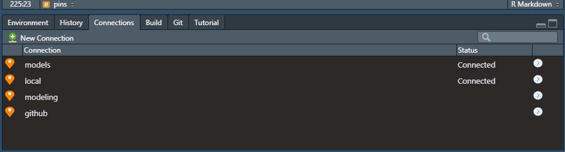

Now that we registered a board, we can use `pins::pin` to `pin` our `tune_results` object to the *models* board. Notice that we use the base AsIs function, `I`, so that our `tune_results` object keeps all of its fancy R properties. We wouldn't need this if we just wanted to save a csv file or something similar.

```{r pin_code}
pin(I(tune_results), name = 'tune_results1', board = 'models')
```

Once you pin `tune_results1` to *models*, you should see something like this:

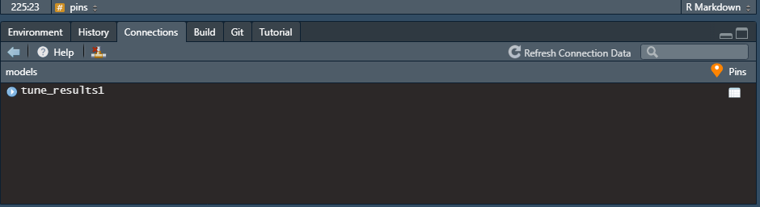

We could quit R and RStudio, and then we could come back later and retrieve our pinned object with `pin_get`. We would not have to re-run `tune_grid` (we would still want to load libraries and perhaps other code). This could save many minutes or hours of waiting around for code to finish running, depending on what you are doing.

```{r pin_get_example1}
pin_get(name = 'tune_results1', board = 'models')
```

When pinning an object and coming back to an analysis later, I will often comment out the expensive computation, and instead just retrieve my desired data with `pin_get`, assigning that data to the same variable. For example:

```{r pin_get_example2}
# tic(msg = 'tuning decision tree hyperparameters')
# tune_results <- tune_grid(
#   tree_workflow, # bundle of model and formula
#   resamples = folds, # cross-validation folds
#   grid = tree_grid # grid of hyperparameter candidates
# )
# toc()
# beep('fanfare')
# 
# pin(I(tune_results), name = 'tune_results1', board = 'models')

tune_results <- pin_get(name = 'tune_results1', board = 'models')
```

Here we see the object is the same. We could then just pick up where we left off without having to run the code again.

```{r}
tune_results
```

If working in an Rmarkdown file, you could also just set the chunk with the expensive computation to `eval = FALSE`.

### parallel processing

It can also be useful to speed up computations by splitting up the work across multiple cores on your computer. You can do this with the following code.

```{r parallel_processing}
num_cores <- parallel::detectCores() - 1 # use all but one core
cl <- parallel::makePSOCKcluster(num_cores)
doParallel::registerDoParallel(cl)
```

The code above sets you up for parallel processing. `tune` is smart enough to just work; it defaults to allowing for parallel processing.

```{r tune_results2}
tic(msg = 'tuning decision tree hyperparameters')
tune_results2 <- tune_grid(
  tree_workflow, # bundle of model and formula
  resamples = folds, # cross-validation folds
  grid = tree_grid # grid of hyperparameter candidates
)
toc()
beep('fanfare')

tune_results2

pin(I(tune_results2), name = 'tune_results2', board = 'models')
```

According to the [docs](https://tune.tidymodels.org/articles/extras/optimizations.html), there are also other packages that you can use, like doFuture.

Outside of the world of tidymodels, there are other packages that I would recommend for parallel processing. Checkout the [furrr](https://github.com/DavisVaughan/furrr) package for parallel processing with `future` and `purrr`. For parallel processing with `dplyr`, look into the excellent [multidplyr](https://multidplyr.tidyverse.org/articles/multidplyr.html) package.

### R jobs

Last, but not least, we should talk about R jobs in RStudio. With jobs, you can run R scripts in the background and continue to use R and RStudio for other work. Depending on how you have your panes set up in RStudio, you should see something like the following somewhere in your IDE:

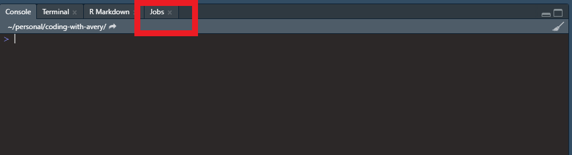

Click on the jobs tab and you will see this:

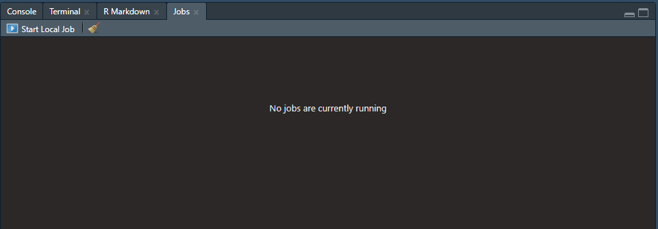

Then click **Start Local Job**.

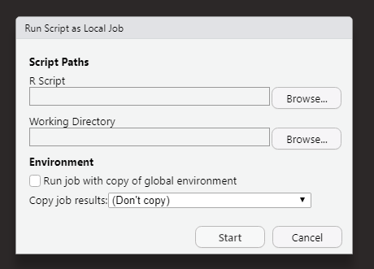

You can then specify what script you want to run as a local job. You can also specify the working directory that you want for the script, which can be important for file paths and reading in data, etc. You will also want to decided whether or not you want the job to run with a copy of the global environment or not, and what you want to do with the results. If you are using `pins` in your script, those objects will get pinned to their respective boards.

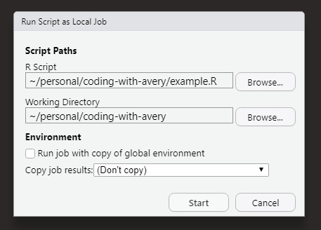

If you insert sections in your script, like seen below, then those section titles will show up above the progress bar of the currently running job. The shortcut, at least on Windows, to insert these sections in an R script is `ctrl` + `shift` + `R`. Maybe a Mac user can confirm in the comments if that is the same or not.

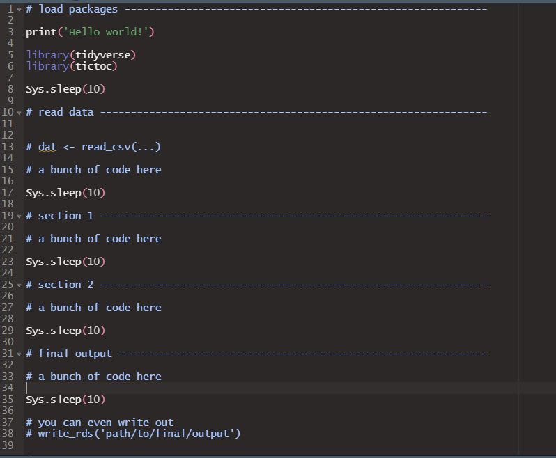

Then the progress of your job can be seen as follows:

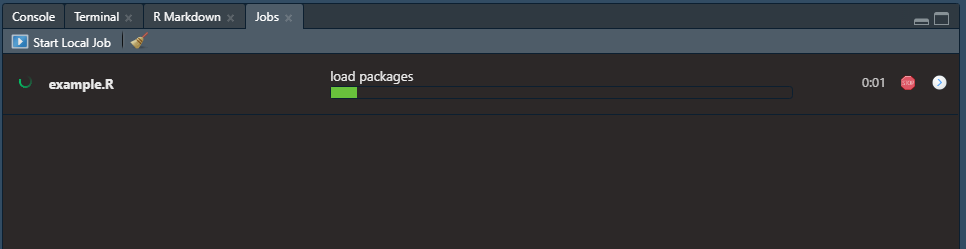

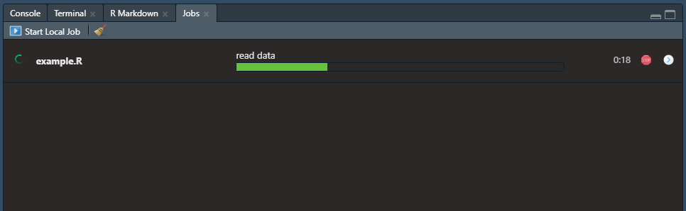

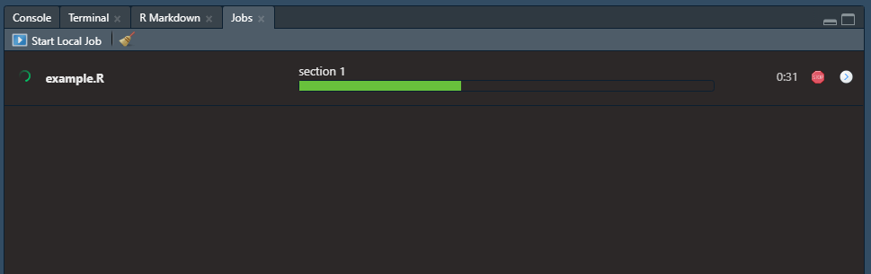

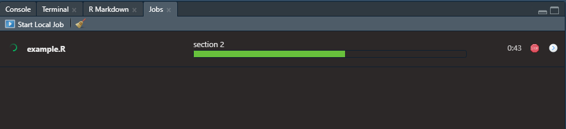

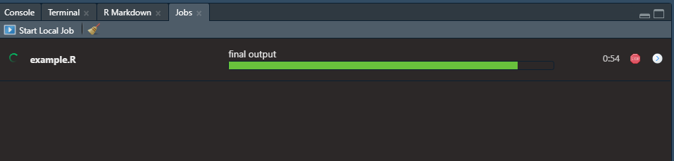

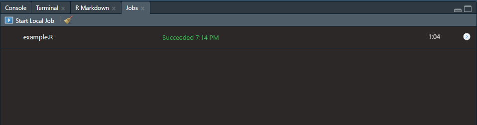

For a more comprehensive look at Jobs, see [here](https://blog.rstudio.com/2019/03/14/rstudio-1-2-jobs/).

### Might as well finish the tidymodels example

I did not really mean to set out to explain as much of the `tidymodels` stuff as I did, but because I said what I said I might as well finish the example. If I wanted to fit the model with the best r-squared to all of the training data and test on the testing data, I would do the following.

First, select the model with the best performing hyperparamters.

```{r best_params}
best_params <- tune_results %>% select_best('rsq')
best_params
```

Second, update or finalize your existing workflow so that the `tune` placeholders are replaced with the actual values of the hyperparameters.

```{r final_wf}
# original workflow
tree_workflow

# finalized workflow
final_workflow <- tree_workflow %>% 
  finalize_workflow(best_params)

final_workflow
```

Third, use the `last_fit` function to train the final workflow/model on the entire training set and validate using the entire testing set. Remember that these two sets are within the `dat_split` object.

```{r final_fit}
final_fit <- last_fit(final_workflow, dat_split)
final_fit
```

How did our final model do? Let's check the metrics.

```{r}
final_fit %>% collect_metrics()
```

Pretty awesome. Our final r-squared value was almost exactly the same as the previous r-squared that we looked at, suggesting that our decision tree regressor did not really overfit the data. In other words, the model seems to be generalizing fairly well on data that it has not seen before. Furthermore, the decision tree model explains about 97% of the variability in our response variable, diamond price.

```{r preds}
dat_pred <- final_fit %>% collect_predictions()
head(dat_pred, 5)
```

Let's plot the actual values against the predicted values real quick to see visually how our model did.

```{r last_plot}
dat_pred %>% 
  ggplot() +
  geom_point(aes(x = price, y = .pred),
             alpha = 0.25, color = 'navy') +
  theme_minimal() +
  labs(title = 'Decision tree does a good job at predicting diamond price')
```

Again, not bad.

The last thing we might do is train the model one last time on all of the data that we have. We could then save this model and use it in a shiny app or create a plumber API to use the model elsewhere.

```{r, eval = FALSE}
final_model <- fit(final_workflow, dat)
# write_rds(final_model, 'path/to/wherever/you/want.rds')
```

### Recap

We looked at the [tictoc](https://cran.r-project.org/web/packages/tictoc/tictoc.pdf) package for timing computations in R. We also had fun with the [beepr](https://www.r-project.org/nosvn/pandoc/beepr.html) package for playing notification sounds. We now know how to cache data and expensive computations with [pins](https://pins.rstudio.com/). By the way, *pins* is also available in corresponding packages in [JavaScript and Python](https://rstudio.com/resources/rstudioglobal-2021/using-pins-with-python-and-javascript/), allowing for cross-language collaboration. Lastly, we touched on parallel processing with R and how to run R scripts in the background with *local jobs*. Hopefully all of these tips and resources will help you when working with computationally expensive code in R.

### Learning more about tidymodels

The [tidymodels website](https://www.tidymodels.org/) has an amazing set of [getting started](https://www.tidymodels.org/start/) tutorials to look into if you are new to `tidymodels`.

### Farewell

Thank you for reading! I truly hope you found something of use here. Stay safe and happy coding!

### R and package versions

```{r}
R.version
packageVersion('tidymodels')
packageVersion('pins')
packageVersion('tictoc')
packageVersion('beepr')
packageVersion('doParallel')
```
