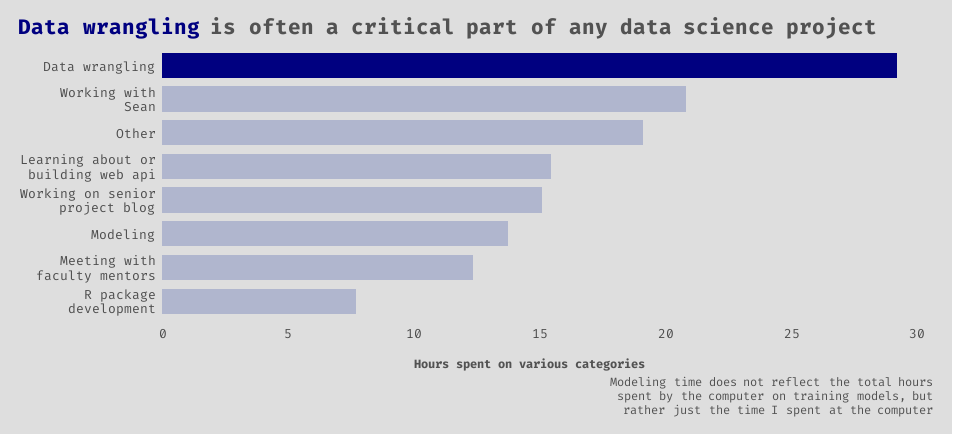
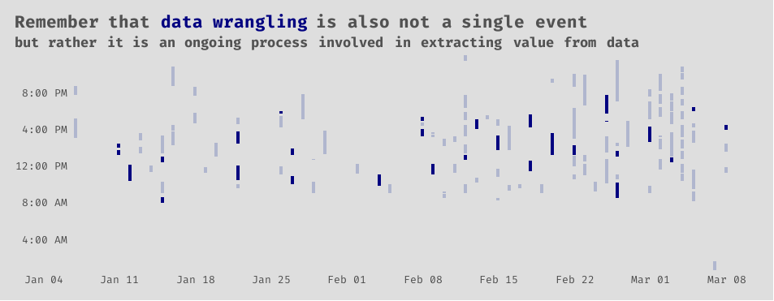
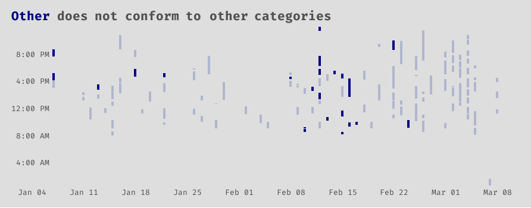

```{r setup, include = FALSE}
knitr::opts_chunk$set(echo = FALSE, eval = FALSE)
```

### Preface

The data science program at BYU-Idaho is super hands on. I love the real world experiences that it has provided me with. The senior project that my friend, Sean, and I have been working on for a couple of months now has probably been the project that I have enjoyed the most in all of my time studying data science. As I mentioned in my [ggtext post](https://codingwithavery.com/posts/2021-02-22-ggtext/), we are building a product for the BYU-Idaho Office of Teacher Preparation in order to help students better prepare to become certified teachers.

More specifically, the product is a web application that individual students will use to see their probability of passing certain exams based on their past performance in various courses (and a few other features). A student uploads their unofficial pdf transcript to the web app, and, in return, they will receive a prediction and some helpful information (like how specific courses may have effected their results).

We have made a ton of progress thus far, and this post is meant to give insight into how I personally have spent my time on various aspects of the project.

The overall project can roughly be broken up into overlapping tasks, such as the following:

-   data collection
-   data cleaning, munging, tidying, and wrangling
-   exploratory data analysis
-   pdf scraping
-   R package development
-   feature engineering and selection
-   training models and selecting the best one
-   web application development
-   web api development
-   deploying the final model
-   sharing journey and results via blog posts

  Interwoven with these tasks are meetings with faculty mentors and many collaboration and coding sessions with my project partner, Sean.

  We use Clockify to track all of our time spent working on the project, and, so far, I have recorded about 130 hours. I recently exported my personal data from Clockify, which includes things like dates, start times, end times, and a description for all the work sessions that I have done. The rest of this post is my attempt to visually tell a story with the data; to help you, the reader, get a better understanding of what we have been working on. If you care to see any of the code for producing the plots, just tap or click on the `show code` buttons that are below each graphic.

```{r}
# This specific code chunk is for loading packages,
# reading in the data, and some light data wrangling
# to create some categories from the Clockify
# description data.

# load packages

library(tidyverse) # all the things
library(janitor) # clean column names
library(lubridate) # working with dates
library(hms) # working with time data
library(tidytext) # working with text
library(ggwordcloud) # wordcloud
library(gghighlight) # highlight important parts of a ggplot
library(ggtext) # styling text in ggplot2
library(showtext) # custom fonts
library(ggrepel) # annotations on gpglots
library(patchwork) # composing multiple ggplots

# add custom font

font_add_google('Fira Code')
showtext_auto()

# set up the theme for all of the plots

my_theme <- theme_minimal() +
  theme(
    text = element_text(family = 'Fira Code'),
    panel.grid = element_blank(),
    panel.spacing = unit(1, "lines"),
    plot.background = element_rect(fill = '#DEDEDE', color = NA),
    plot.margin = unit(c(.5,.5,.5,.5), 'cm'),
    plot.title.position = 'plot',
    plot.title = element_markdown(size = 16,
                                  face = 'bold',
                                  color = '#525252',
                                  lineheight = 1.2),
    plot.subtitle = element_markdown(size = 13,
                                    face = 'bold',
                                    color = '#525252',
                                    lineheight = 1.2),
    plot.caption = element_markdown(color = '#525252',
                                    lineheight = 1.2),
    axis.text = element_text(size = 10),
    axis.text.y = element_text(margin = margin(0,-25,0,0)),
    axis.title = element_text(size = 9, face = 'bold', color = '#525252'),
    axis.title.x = element_text(margin = unit(c(.5, 0, 0, 0), "cm")))

theme_set(my_theme)

# read in data

# data comes from one of my github
# repos called 'robbins-data'

url <- "https://raw.githubusercontent.com/averyrobbins1/robbins-data/master/coding-with-avery/clockify_senior_project.csv"

# read in data from github
# and clean column names

dat <- read_csv(url) %>% 
  janitor::clean_names() %>% 
  mutate(across(contains('date'), mdy),
         across(contains('time'), as.POSIXct)) #datetime

# What does the data look like?

# glimpse(dat)
# 
# Rows: 123
# Columns: 7
# $ description      <chr> "wrangling data", "Met with Sean", "'finishing up' the api", "Plumber", "data~
# $ start_date       <date> 2021-03-08, 2021-03-08, 2021-03-08, 2021-03-07, 2021-03-05, 2021-03-05, 2021~
# $ start_time       <dttm> 1970-01-01 15:51:01, 1970-01-01 13:30:00, 1970-01-01 11:15:00, 1970-01-01 00~
# $ end_date         <date> 2021-03-08, 2021-03-08, 2021-03-08, 2021-03-07, 2021-03-05, 2021-03-05, 2021~
# $ end_time         <dttm> 1970-01-01 16:27:26, 1970-01-01 14:25:00, 1970-01-01 11:48:00, 1970-01-01 01~
# $ duration_h       <time> 00:36:25, 00:55:00, 00:33:00, 01:00:13, 00:25:43, 00:26:33, 01:22:30, 02:07:~
# $ duration_decimal <dbl> 0.61, 0.92, 0.55, 1.00, 0.43, 0.44, 1.38, 2.13, 1.06, 0.63, 0.77, 0.83, 0.70,~

dat2 <- dat %>% 
  mutate(
    description = str_to_lower(description),
    category = case_when(
     
      str_detect(description, 
        'data wrangling|wrangling data|wrangling|wrangle|clean|tidy|eda') ~ 'Data wrangling',
      str_detect(description,
        'nygaard|hathaway') ~ 'Meeting with\nfaculty mentors',
      str_detect(description,
        'sean') ~ 'Working with\nSean',
      str_detect(description,
        'pdf scraping|pdf|scraping|r package|tidytranscript|R package|package') ~ 'R package\ndevelopment',
      str_detect(description, 
        'tidymodels|modeling|model|machine learning|ml|resampling') ~ 'Modeling',
      str_detect(description,
        'http|fetch|api|plumber') ~ 'Learning about or\nbuilding web api',
      str_detect(description,
        'blog post|post|blog')  ~ 'Working on senior\nproject blog',
      TRUE ~ 'Other'
    )
  )
```

### Storytelling with data

We'll start with a simple word cloud created from the descriptions that I wrote for each time period recorded. **The size of the word reflects its frequency within the descriptions.** From here, you can see that I *met with Sean* a lot. You also might notice our faculty mentors, J. Hathaway and Jackie Nygaard, whom we meet with on a weekly basis.

Can you get a rough idea of what we have been working on? We kind of already talked about some of this in the preface, so you probably already know the gist of it. There is no shortage of data wrangling.

More specifically we have done our modeling with the `tidymodels` R package, and are building our web api with the `plumber` R package. We have done a fair amount of *studying* in order to learn technologies that we are unfamiliar with, and our best model was an elastic net logistic regression. Apparently, one time I thought *modeling* was spelled with two *L*'s. Lastly, we write some *blog posts,* like this one, to share our project.


```{r, eval = FALSE}
data("stop_words")

set.seed(123)
dat %>% 
  unnest_tokens(word, description) %>%
  count(word, sort = TRUE) %>% 
  anti_join(stop_words) %>% 
  ggplot(aes(label = word, size = n)) +
  geom_text_wordcloud() +
  scale_size_area(max_size = 20) +
  theme_minimal()

```

Exploring and getting the data in exactly the right format that we needed for it to be useful took considerable time! Sometimes an aspiring data scientist, such as myself, might be fooled by thinking that they are going to be writing cool machine learning algorithms all day. This is hardly the case. I would also guess that at least a third of the "Working with Sean" category involved more data wrangling.



```{r}
dat2 %>%
  group_by(category) %>% 
  summarise(sum_time = sum(duration_decimal, na.rm = TRUE)) %>% 
  ungroup() %>% 
  ggplot() +
  geom_col(aes(x = sum_time, y = reorder(category, sum_time)),
           fill = 'navy', width = 0.75) +
  gghighlight(category == 'Data wrangling',
              unhighlighted_params = list(fill = '#B0B6CE')) +
  scale_x_continuous(breaks = seq(0, 30, 5)) +
  labs(
    title = "<b style = 'color:navy;'>Data wrangling</b> is often a critical part of any data science project",
    x = 'Hours spent on various categories',
    y = NULL,
    caption = 'Modeling time does not reflect the total hours<br>spent by the computer on training models, but<br>rather just the time I spent at the computer'
    )
```

The next series of graphics all share the same data.

Now let's look at the date and time data. Is anyone else as scattered as I am? To be fair, being my last semester at BYU-Idaho, I am enrolled in 17 credits, or 6 courses. You can imagine my other course work filling in these gaps. Still, it is interesting to see the scattered nature of my work-from-home behaviors with regards to my senior project. **According to these data, my average (mean) work session for my senior project lasted about 65 minutes.**


```{r}
dat_label <- tribble(
  ~ start_date,  ~ time,               ~ label,
  '2021-02-02', '1970-01-01 10:15:00', 'start time',
  '2021-02-02', '1970-01-01 12:45:00', 'end time'
) %>% 
  mutate(
    start_date = ymd(start_date),
    time = as.POSIXct(time)
  )

dat_seg <- tribble(
  ~ start_date, ~ end_date,   ~ time,
  '2021-01-29', '2021-01-30', '1970-01-01 10:15:00',
  '2021-01-29', '2021-01-30', '1970-01-01 12:45:00',
) %>% 
  mutate(
    start_date = ymd(start_date),
    end_date = ymd(end_date),
    time = as.POSIXct(time)
  )

ggplot(dat2) +
  geom_segment(aes(x = start_date,
                   y = start_time,
                   xend = start_date,
                   yend = end_time),
               size = 1.5,
               color = 'navy') +
  geom_text(data = dat_label,
            mapping = aes(x = start_date, y = time, label = label),
            color = '#525252') +
  geom_segment(data = dat_seg,
            mapping = aes(x = start_date, y = time,
                          xend = end_date, yend = time),
            size = 1.05, color = '#525252',
            arrow = arrow(ends = 'first', length = unit(0.25, 'cm'))) +
  scale_x_date(
    date_breaks = '1 week',
    date_labels = '%b %d'
  ) +
  scale_y_datetime(
    date_breaks = '4 hour',
    date_labels = "%l:%M %p",
    expand = c(0,0)) +
  labs(
    title = "Projects that will cause an impact are likewise impacted by the<br>time that you dedicate to them",
    x = NULL,
    y = NULL
  )
```

Learning to work well with others is vital. It has been amazing to see Sean and I accomplish things that we would not have been able to on our own. We tend to balance each other out, and our skills seem to complement each other. It has also been extremely rewarding to be able to collaborate with and receive feedback from our faculty mentors, Jackie Nygaard, and J. Hathaway.


```{r}
p <- dat2 %>% 
  mutate(
    sean = str_detect(description, 'sean'),
    mentors = str_detect(description, 'hathaway|nygaard')
  ) %>% 
ggplot() +
  geom_segment(aes(x = start_date,
                   y = start_time,
                   xend = start_date,
                   yend = end_time),
               size = 1.5,
               color = 'navy') +
  scale_x_date(
    date_breaks = '2 week',
    date_labels = '%b %d'
  ) +
  scale_y_datetime(
    date_breaks = '6 hour',
    date_labels = "%l:%M %p",
    expand = c(0,0))

p_sean <- p + 
  gghighlight(sean == TRUE, 
              unhighlighted_params = list(color = '#B0B6CE')) +
  labs(
    subtitle = "Collaborating with <span style = 'color:navy;'>Sean</span>",
    x = NULL,
    y = NULL
  )
  
p_mentors <- p + 
  gghighlight(mentors == TRUE,
              unhighlighted_params = list(color = '#B0B6CE')) +
  labs(
    subtitle = "Meeting with <span style = 'color:navy;'>faculty mentors</span>",
    x = NULL,
    y = NULL
  )

# for some reason the theme doesn't work as well with the patchwork,
# so I have to write it out again

(p_sean / p_mentors) +
  plot_annotation(title = 'And they are often not accomplished in isolation') &
  my_theme
```

Again, we come back to data wrangling. Like Thanos, it is inevitable. The nature of the data work will likely shift over the life of a project, but it can be dispersed throughout it. You may do more cleaning and tidying at the start, eda and summary statistics in the middle, and feature engineering and selection towards the end. Whatever happens, though, do not be surprised if you are not actually done with data wrangling when you think you are.



```{r}
ggplot(dat2) +
  geom_segment(aes(x = start_date,
                   y = start_time,
                   xend = start_date,
                   yend = end_time),
               size = 1.5,
               color = 'navy') +
  gghighlight(category == 'Data wrangling',
              unhighlighted_params = list(color = '#B0B6CE')) +
  scale_x_date(
    date_breaks = '1 week',
    date_labels = '%b %d'
  ) +
  scale_y_datetime(
    date_breaks = '4 hour',
    date_labels = "%l:%M %p",
    expand = c(0,0)) +
  labs(
    title = "Remember that <b style = 'color:navy;'>data wrangling</b> is also not a single event",
    subtitle = "but rather it is an ongoing process involved in extracting value from data",
    x = NULL,
    y = NULL
  )
```

Now we get to the fun stuff, right?

Since our web application ingests a pdf to feed data to the machine learning model, we built an R package to scrape and tidy the data from unofficial pdf transcripts. As fans of R and the `tidyverse` , we are embarrassingly proud of the package's name: `tidytranscript`. Much of that work Sean and I did together, so some of that was likely swallowed up in the "Working with Sean" category.

You can also see that tasks like machine learning and building web APIs come later in the lifetime of the project. You cannot do much with data until you have them it the right format.


```{r}
p2 <- dat2 %>% 
ggplot() +
  geom_segment(aes(x = start_date,
                   y = start_time,
                   xend = start_date,
                   yend = end_time),
               size = 1.5,
               color = 'navy') +
  scale_x_date(
    date_breaks = '2 week',
    date_labels = '%b %d'
  ) +
  scale_y_datetime(
    date_breaks = '6 hour',
    date_labels = "%l:%M %p",
    expand = c(0,0))

p_package <- p2 + 
  gghighlight(category == 'R package\ndevelopment', 
              unhighlighted_params = list(color = '#B0B6CE')) +
  labs(
    subtitle = "Developing an <span style = 'color:navy;'>R package</span>",
    x = NULL,
    y = NULL
  )
  
p_model <- p2 + 
  gghighlight(category == 'Modeling',
              unhighlighted_params = list(color = '#B0B6CE')) +
  labs(
    subtitle = "Tuning and training <span style = 'color:navy;'>machine learning algorithms</span>",
    x = NULL,
    y = NULL
  )

p_api <- p2 + 
  gghighlight(category == 'Learning about or\nbuilding web api',
              unhighlighted_params = list(color = '#B0B6CE')) +
  labs(
    subtitle = "Building a <span style = 'color:navy;'>web api</span> to serve a model",
    x = NULL,
    y = NULL
  )

(p_package / p_model / p_api) +
  plot_annotation(title = 'Data science projects also involve a diverse set of tasks') &
  my_theme

```

I include this last plot solely as a reminder to myself to keep better data; be more specific in your descriptions, Avery. Some I left blank, others I was very vague. As far as I could tell from reading some descriptions, this other category is a mix of studying new concepts, writing posts, eda, and yet more data wrangling.



```{r}
ggplot(dat2) +
  geom_segment(aes(x = start_date,
                   y = start_time,
                   xend = start_date,
                   yend = end_time),
               size = 1.5,
               color = 'navy') +
  gghighlight(category == 'Other',
              unhighlighted_params = list(color = '#B0B6CE')) +
  scale_x_date(
    date_breaks = '1 week',
    date_labels = '%b %d'
  ) +
  scale_y_datetime(
    date_breaks = '4 hour',
    date_labels = "%l:%M %p",
    expand = c(0,0)) +
  labs(
    title = "<b style = 'color:navy;'>Other</b> does not conform to other categories",
   
    x = NULL,
    y = NULL
  )
```

Data science projects are complex and often consist of many moving parts! 

### The end

Thanks for letting me tell you this story. I hope you enjoyed it! As always, I am open to questions and feedback. Leave a comment, or shoot me an email at [avery\@codingwithavery.com](mailto:avery@codingwithavery.com){.email}. Stay safe and happy coding!
