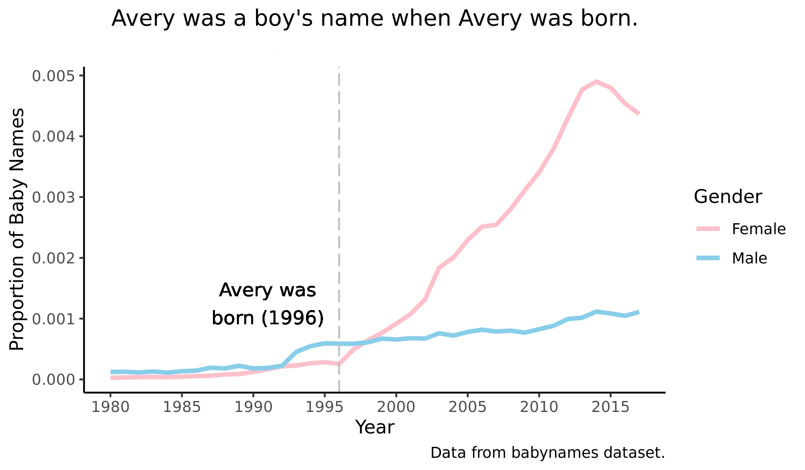

```{r setup, include=FALSE}
knitr::opts_chunk$set(echo = FALSE)
```




:arrow_up: Written in R with ggplot2 :grinning: 

I created the above graphic in June 2019 when the BYU-Idaho Data Science Society
presidency attended a R/tidyverse workshop given by Garrett Grolemund,
co-author of [R for Data Science](https://r4ds.had.co.nz/). 

## Evolution of Avery R

At least one good thing to come out of the global coronavirus pandemic of 2020
was that I finally had time to sit down and create my personal website. The main
hurdle was figuring out how Hugo and blogdown worked, and now it is just getting
the right words onto the page.

The inception of this website marks about two years since I started programming in R. I have long wanted to create a space to communicate to employers and others
the value that I can provide. Even more important to me than that, I have wanted
to share much of what I have learned about working with data in R, so that perhaps
other people could benefit from my hundreds of hours spent staring at code that I think should work but doesn't because I forgot a closing parenthesis.

I love R, and I appreciate the things that people have done to add to the 
language. It is an extremely powerful environment for statistical analysis, reproducible work, and data wrangling & visualization. Ultimately, with this website I hope to share with you some knowledge and a plethora of useful tips with regards to R. All this in hopes to make your life a little bit easier.

Truthfully, the creation of this website marks a great victory over procrastination.
It has been rewarding to be able to check this off of the to-do list.
Hopefully you are not reading this while procrastinating some project of your own.
If you are, please stop! Go and do that thing that you know you should be doing!
It is definitely worth it. Otherwise, feel free to check out one of my posts. Happy coding!

----

If you are both an R user and a fan of *Avatar: The Last Airbender*, check out 
my simple R package [appa](https://github.com/averyrobbins1/appa) and have fun
with transcript data from perhaps the greatest animated show ever created.

If you are interested in learning from other R users, go to [r-bloggers.com](https://www.r-bloggers.com/)!

----

*For the things we have to learn before we can do them, we learn by doing them.*

― Aristotle, The Nicomachean Ethics

----
